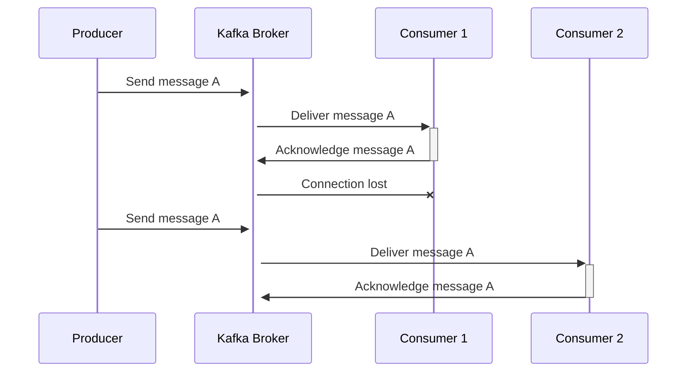
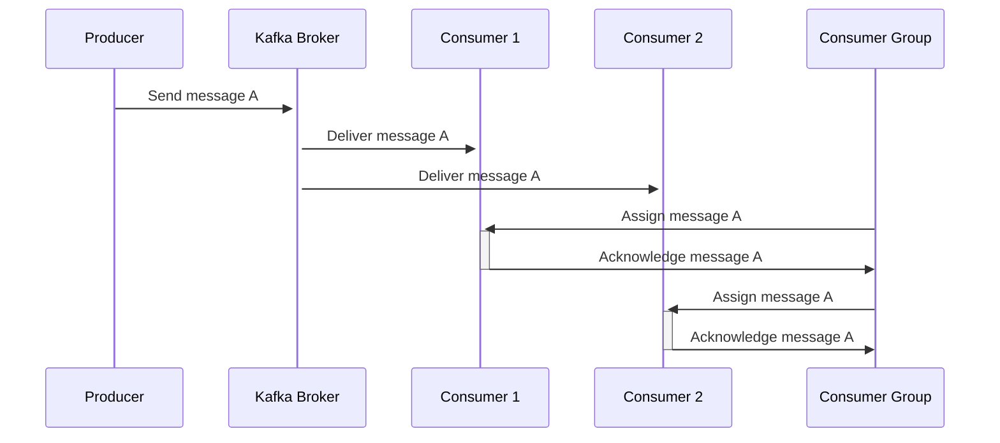
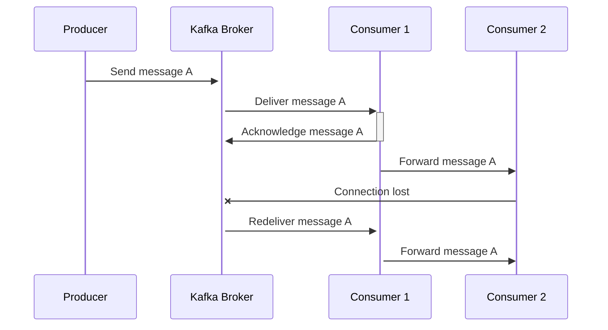

Kafka is a distributed streaming platform that is designed to handle high volume, high velocity data streams. It is used for real-time data processing, messaging, and analytics. One of the key features of Kafka is its ability to ensure data integrity and reliability, especially when it comes to preventing duplicate messages. In this article, we will explore some of the scenarios in which duplicates can happen and how to prevent them.

This article is a continuation of the topic and is related to another popular article on my blog, [When Can We Lose Messages in Kafka](https://developer20.com/when-you-can-nose-messages-in-kafka/)? It is essential to understand when messages can be lost and when they can be duplicated because both scenarios can cause significant problems for data processing and analytics.

## Producer Retries

Kafka producers send messages to Kafka brokers, which in turn store and distribute those messages to consumer applications. In case of network issues or broker unavailability, the producer might retry sending the message. If the original message was not acknowledged by the broker, the producer will send it again, potentially leading to duplicates. To prevent this, producers can use message deduplication techniques such as message IDs or sequence numbers, to ensure that only one copy of the message is sent. Additionally, you can use the `enable.idempotence` producer configuration option, which ensures that messages sent to Kafka are delivered only once, even in the case of retries due to network failures or broker unavailability.

## Network Failures

Network failures can cause messages to be duplicated. For example, if a broker fails to receive an acknowledgement from a producer, it might assume that the message was not delivered and request it again. In this case, the producer should use the idempotent producer feature provided by Kafka, which guarantees that messages will be delivered only once even if they are sent multiple times.

## Consumer Failures
Consumer applications can fail, and when they restart, they might read the same messages again, leading to duplicates. To avoid this, Kafka provides offset management, which allows consumers to keep track of the last message they processed. This ensures that only new messages are read when the consumer restarts. You can use the `auto.offset.reset` consumer configuration option, which determines what to do when a consumer starts reading messages from a new topic or partition. Setting it to "latest" ensures that the consumer starts reading from the latest available message, avoiding the possibility of reading duplicates.

## Processing Errors

Consumer applications might encounter processing errors, which can result in messages being processed multiple times. For example, if a consumer crashes while processing a message, and the message was not committed to the Kafka broker, it will be read again when the consumer restarts. To prevent this, consumers can use transactional processing, which ensures that messages are only committed to the broker when they have been processed successfully. You can use the `isolation.level` consumer configuration option, which controls the visibility of transactions. Setting it to "read_committed" ensures that only messages that have been successfully processed are read by the consumer, avoiding the possibility of processing errors leading to duplicates. Additionally, you can use the `max.poll.records` consumer configuration option, which limits the number of records returned in each poll request, preventing the consumer from processing too many records in one go and increasing the likelihood of processing errors.

## Retention Policy
Kafka has a retention policy that determines how long messages are kept in the system. If messages are kept for too long, they might be read by consumers even if they have already been processed, resulting in duplicates. To prevent this, you can set a proper retention policy and ensure that messages are removed from Kafka after they are no longer needed. You can use the log.retention.ms or log.retention.minutes configuration options to control the retention time of messages in Kafka.

## Conclution

Duplicate messages can be a significant problem when processing data streams in Kafka. Understanding the scenarios in which duplicates can occur is essential to prevent data inconsistencies and ensure data integrity. In this article, we explored some of the scenarios in which duplicates can happen and how to prevent them by using proper configuration options and techniques such as message deduplication, offset management, transactional processing, and retention policy.

If you want to learn more about Kafka and its features, check out the [official documentation](https://kafka.apache.org/documentation/). Also, don't forget to read the related article on my blog, [When Can We Lose Messages in Kafka?](https://developer20.com/when-you-can-nose-messages-in-kafka/), which explores the scenarios in which messages can be lost in Kafka.
