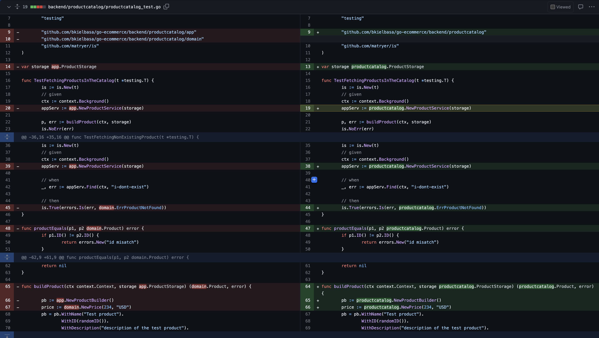

Creating an organized code structure can be a complex endeavor. Previously, I penned a blog post entitled [How to structure Go code?](/how-to-structure-go-code/), an attempt to demystify this topic. While I stand by the insights shared, I've come to realize that the article is somewhat generic and lacks clear, tangible answers to the question at hand.

There's arguably no better way to understand such concepts than by diving into concrete examples. Today, I'd like to discuss the evolution of a package named `productcatalog` and explain why I chose to streamline its structure.

`Productcatalog` was the pioneer package of this project, built with the aim of providing information about all purchasable products. At present, its functionality is simple - it retrieves data from a database table and serves it via a JSON API. From the onset, I was committed to maintaining an effective project structure, so I divided the `productcatalog` package into four smaller components: `app`, `port`, `adapter`, and `domain`. At face value, this seemed like a sound approach, so I proceeded accordingly.

Though everything functioned as expected, I couldn't shake off the feeling that something wasn't quite right. As it stands, the `productcatalog` only serves products for the homepage and product details page and houses minimal additional logic. Despite my intent to keep infrastructure-related elements separate from business logic, having packages containing just a single file seemed excessive.

Upon reflection, I realized that I had fallen into a common pitfall - overengineering the package in anticipation of future complexity that had yet to materialize.

> Premature optimization is the root of all evil (or at least most of it) in programming.
> [Donald Knuth](https://en.wikipedia.org/wiki/Donald_Knuth).

This decision wasn't without consequences. A notable issue was the need to make public certain types that ideally should have remained private. Although I could have used the `internal` package, this felt more like a workaround than a solution. This is a widespread issue: we often overlook the importance of concealing low-level details from our public API.



This brings us to an often overlooked aspect of our development cycle - simplifying our work. I'm certainly guilty of this oversight. Once we have functioning code, we often neglect to consider ways to make it simpler or easier to read. This is why I advocate for outside-in testing. Such an approach allows for extensive refactoring with minimal or no changes in tests. Consider how tests were [affected by changing the structure of the project](https://github.com/golang-app/ecommerce/pull/57/files#diff-4ea0762aed35c91c2b563b2121d606ba305b59fef7899dcb892031bf18f28f0bR19).

The tests themselves remained unchanged. Only the imports and some helper methods/functions were modified. Tests remain functional without any modification.

Conversely, when we test the internals of the package the way I demonstrated in the tweet:



... it can result in cascading changes in multiple tests, making **any refactoring significantly more challenging**. While minimizing the public API might seem like the right move, we often forget to do so.

In conclusion, the journey of structuring the productcatalog package has been a learning experience, from over-engineering to simplifying and then understanding the nuances of public and private APIs. Testing strategies have played a vital role, emphasizing the importance of simplicity and organization in coding.

Through this experience, we are reminded that coding isn't just about getting a program to work—it's also about creating a structure that's sustainable, scalable, and easy to understand. We often overlook the importance of simplicity, yet it's in simplification that we can often find elegance and efficiency.

I hope you found this exploration of structuring and testing useful for your projects. Feel free to share your thoughts, experiences, or ideas in the comments below. Discussion often leads to new insights and solutions, and we all stand to benefit from a shared understanding and collaborative mindset. Happy coding!