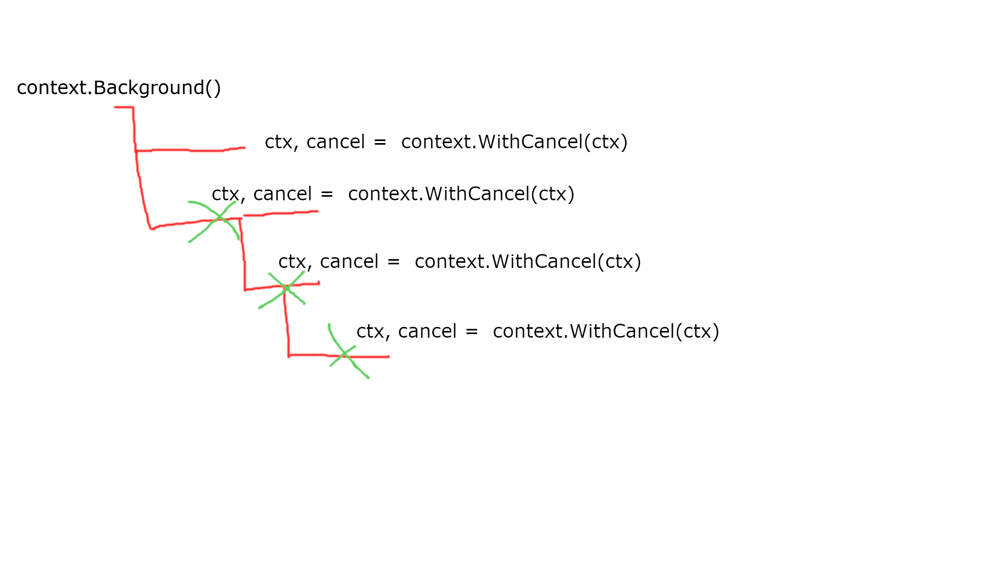

The `context` package in Go is quite simple and well-known. On the other hand, there are some misunderstandings while using it. Today, I'll try to explain all the most popular concerns and make more clear when and how use the `Context`.

Let's start with what the context is.

> Package context defines the Context type, which carries deadlines, cancellation signals, and other request-scoped values across API boundaries and between processes.
> ref: [https://golang.org/pkg/context/](https://golang.org/pkg/context/)

In other words, the context is for stoping goroutines and it carries request-scoped values. What exactly does it mean in practice?

The most popular use case is when you have a request-response pattern. The request can be a HTTP request or a CLI command. Very often, to do your job you have to make a DB query, send a request to external API, read some data from a redis cluster or write those bytes to the filesystem. Everything can take some time.

By a convention, the context is passed as the very first argument in a function. Almost everywhere you'll find calling it `ctx`.

```go
func myFunc(ctx context.Context, param1 int) error }
```

In fact, the `context.Context` is a small interface but very powerful one. The first method we'll discuss is `Done()`.

```go
type Context interface {
    Done() <-chan struct{}
```

There can be three reasons why the context was canceled:

- somewhere on the parent or current context a `cancel()` function was called
- deadline was reached
- timeout was reached

If the timeout or deadline was set we can read how much time we have before cancelling the deadline using `Deadline()` function.

```go
type Context interface {
    Done() <-chan struct{}
    Err() error
    Deadline() (deadline time.Time, ok bool)
```

If the `ok` parameter returns a `true` it means the deadline or a time was set. The first returned value will contain the point in time the context will be canceled.

The last function in the `context.Context` interface is `Value(key, value)`. You can use it to fetch a value that was stored in the context earlier.

## Operations on the context

You can create the context using one of two methods: `context.Background()` and `context.TODO()`. The first one should be use always where you start a new app in the `main()` function, when accepting a new request from a client (HTTP, gRPC, TCP etc) or in tests. You should use `context.TODO()` whenever you'd like add the context to your code but the caller function doesn't support it yet.

```go
func foo(param1 int, param2 string) error {
    // doing some work...
    return bar(context.TODO(), param1, param2)
}
```

Every of three next functions return a new context (it's a copy of the parent context but with a small modification) and a cancel function. The cancel function immediately cancels the context.

The `context.WithCancel(ctx)` function does nothing except just returning a new context with the cancel function.

```go
func foo(ctx context.Context, second int, last string) error {
    ctx, cancel := context.WithCancel(ctx)
    defer cancel()

    // do your job here
}
```

Function `context.WithTimeout(ctx, timeout)` returns a new context that is canceled after the specified timeout. Let me explain how the next example works.

```go
func slowOperationWithTimeout(ctx context.Context) (Result, error) {
    ctx, cancel := context.WithTimeout(ctx, 100*time.Millisecond)
    defer cancel()
    return slowOperation(ctx)
}
```

Let's assume that the `slowOperation()` can be very slow. Thanks to adding the timeout to the context, we're making sure that the operation won't take longer than 100 milliseconds.

The `context.WithDeadline` works very similar to the previous one but with the difference that we're defining the point in time (in the future) that we want to cancel the context.


const shortDuration = 1 * time.Millisecond

func main() {
    d := time.Now().Add(shortDuration)
    ctx, cancel := context.WithDeadline(context.Background(), d)
    defer cancel()

    select {
    case <-time.After(1 * time.Second):
        fmt.Println("overslept")
        case <-ctx.Done():
        fmt.Println(ctx.Err())
    }
}


The output of the code is `context deadline exceeded`. Why? The deadline is set to now + 1 millisecond. It's earlier than 1 second defined in the timer. 

The next available method is `context.WithValue:`


func WithValue(parent Context, key, val interface{}) Context


It returns a new context based on the parent with the key-value set. The key can be everything but there's a practice to create a custom types instead of build-in types like `int` or `string`. Why? It helps avoiding naming collisions. Imagine a situation that two packages set the a different value in the same key. It can be confusing and can lead to hard to find bugs. You can use just an empty struct for it.


type myKey struct{}

func foo(ctx context.Context) {
    // ctx = WithValue(ctx, "my key", "my awesome value") - it can lead to a naming conflicts
   ctx = ctx.WithValue(ctx, myKey{}, "my awesome value")
}



## Should you always call `cancel()` function?

Fuctions `WithTimeout` and `WithDeadline` not only set the point in the time when the context is canceled but return a cancel function. You can use it to cancel the context before the deadline or timeout. The question is: should you always cancel if even if the context is canceled anyway? The answer is: **yes.**


func main() {
    d := time.Now().Add(shortDuration)
    ctx, _ := context.WithDeadline(context.Background(), d) // careful!

    // do what you have to do
    foo(ctx)
}


Imagine that `foo(ctx)` spans other goroutines with the context inside. When `foo()` finishes it's work, those goroutines can still be running and waiting for the deadline. For one or two gorutines it may not have a big impact but when you span `foo()` hundred of times in a second/minute it may be noticeable.

## How cancellation works?

I think the picture below will help you understand it.



There are some situations you can use the package in a more creative way. You can use the cancellation mechanism to cut the tail on some metrics. Imagine a situation where you send requests to an external API. In general, the API sends the response very quickly. Let's say the average time is between 50 and 100 ms. However, from time to time, the API sends the response in a second and then, everything come backs to the normal behavior.

Slower external API responses can make your API slower as well because you're waiting for the data from somewhere else. Let's assume that the request we send is immutable. It means ti doesn't change anything - it just fetches some data. You can solve the problem using (at least) two approaches.

The first one is sending multiple requests at once and cancel every request when we receive the fastest one. It has some weaknesses. You increase the network traffic as well as putting more pressure on someone else service.

The second thing is setting a timeout to the request, let's say 150 ms and when it hits the deadline and resend the request one more time. Every retry can have slightly bigger timeout and after a few attempts you can fail the request.

I know that those examples aren't perfect and are very use-case specific but I hope I gave you a clue how the `context.Context` can be useful in your code.

## Summary

I hope I helped you more about how the `context` package works. As you can see, it's a simple tool but gives a lot of control of how our code behaves. Thank's to it, you can utilize the resources and make your code more resilient.
