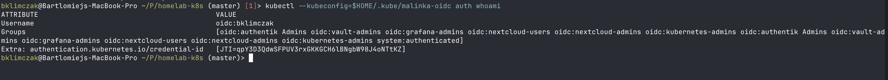
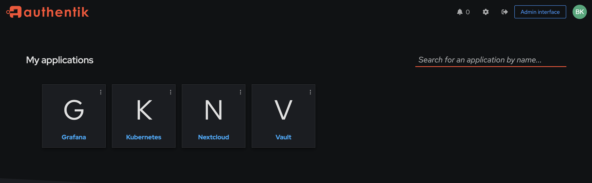

I have a small homelab cluster — a Raspberry Pi 5 control plane, three amd64 workers, kubeadm holding it all together. For years, every app on it had its own login form. Vault had a root token in my password manager. Grafana had an admin user. Nextcloud had a different admin user. Headlamp had a service account token I copied around. Every app I added made the mess worse.

So I sat down one weekend to fix it. The plan was simple: install [Authentik](https://goauthentik.io/), wire every app to it via OIDC, and stop juggling logins. The plan was simple. The execution was not.

This is not a tutorial. There are plenty of those. This is a list of the things that wasted my time, in the order they wasted it, so that maybe yours gets wasted a little less.

## What I started with

A handful of apps, all already running on the cluster:

* **Vault** — secrets store, Helm-installed, raft-backed.
* **Grafana** — bundled in `kube-prometheus-stack`.
* **Nextcloud** — files, calendar, the usual.
* **Headlamp** — the Kubernetes dashboard.
* **kubectl** — running from my laptop with a long-lived admin kubeconfig.

Everything was Terraform-managed: one `*.tf` file per app, a `values/*.yaml` next to it for Helm. I wanted Authentik to fit into that same shape so adding the next app would mean a 30-line Terraform file and nothing else.

It mostly worked. The 30-line files exist. But getting there took a different number of hours than I'd planned.

## The first wall: a network that doesn't loop back

My home router doesn't hairpin NAT. I knew this in the abstract. I did not feel it until pods inside the cluster started failing to talk to Authentik.

The setup is mundane. Public DNS `*.klimczak.xyz` points to my public IP. From outside the network, everything resolves and works. From inside a pod, the pod resolves `authentik.klimczak.xyz` to the public IP, sends a packet to it, the packet leaves the cluster, hits my router, and the router refuses to bend it back inward. The connection just hangs.

Pi-hole runs on the network with internal A records pointing at the nginx-ingress LoadBalancer (`192.168.1.30`), so apps that use Pi-hole as their resolver are fine. The fix for the rest is one of:

* Configure the cluster's DNS to forward to Pi-hole.
* Sprinkle `hostAliases` on Deployments that need it.
* For static pods like `kube-apiserver`, edit `/etc/hosts` on the host, because static pods don't inherit it from anywhere clean (more on this later).

The lesson: **always test reachability from inside the actual consuming pod, not from your laptop**. My laptop hits Authentik over the public address fine. The pod two meters away from my laptop cannot.

## The second wall: certificates without port 80

Port 80 isn't forwarded to my cluster. I'd been ignoring that because everything had certificates already — `cert-manager` had been issuing them via HTTP-01 ACME at some point in the past. None of them were renewing. They'd just stop working in roughly 90 days and I'd notice when something started 503-ing.

The fix is DNS-01 with the OVH webhook (my registrar) — a separate `ClusterIssuer` (`letsencrypt-prod-dns`) and every Ingress migrated to it. Boring change, but the failure mode is so quiet it deserves attention before you have a dozen apps depending on the broken issuer.

## The biggest gotcha: the empty groups claim

This one cost me an entire evening across two different apps before I figured it out.

You configure Authentik. You create a group, put your user in it, attach a policy binding to the application. You request the `groups` scope on the consumer. You log in. The token comes back with `"groups": []`.

You stare at the token. You stare at the Authentik UI showing your user is in the group. You stare at the token again. You read the docs. The default `profile` scope says it includes groups. You rebuild the property mappings. Same result.

What's actually happening: Authentik's default `profile` scope mapping uses Django's generic `request.user.groups.all()` accessor, which silently returns an empty queryset in modern Authentik. The canonical accessor is `request.user.ak_groups.all()`. The default mapping has not been updated. It works. It returns no data.

The fix is one custom property mapping that every app reuses:

```hcl
resource "authentik_property_mapping_provider_scope" "groups" {
  name       = "OAuth2 groups"
  scope_name = "groups"
  expression = <<-EOT
    return {
      "groups": [group.name for group in request.user.ak_groups.all()],
    }
  EOT
}
```

Then attach this scope's ID to every `authentik_provider_oauth2`'s `property_mappings`, and request `groups` on the consumer side. Without **both** of those, group-based authorization rules silently deny everyone — which is the worst possible failure mode, because it looks like "your user just isn't in the group" until you finally inspect the actual JWT.

If you take one thing from this post, take this. The `groups` claim is the part that breaks. Always check it first.

## The shape of the whole thing

Before the per-app trenches, the high-level picture. Every arrow below is an OIDC flow:

```
                       ┌─────────────────┐
                       │    Authentik    │   authentik.klimczak.xyz
                       │   (OIDC IdP)    │
                       └────────┬────────┘
                                │
       ┌─────────┬──────────────┼──────────────┬─────────┐
       │         │              │              │         │
       ▼         ▼              ▼              ▼         ▼
   ┌───────┐ ┌────────┐ ┌──────────┐ ┌──────────┐ ┌──────────┐
   │ Vault │ │Grafana │ │Nextcloud │ │ Headlamp │ │ kubectl  │
   │  JWT  │ │Generic │ │ user_oidc│ │  (OIDC,  │ │  (oidc-  │
   │  auth │ │ OAuth2 │ │   app    │ │ token to │ │  login)  │
   │       │ │        │ │          │ │apiserver)│ │          │
   └───────┘ └────────┘ └──────────┘ └────┬─────┘ └────┬─────┘
                                          │            │
                                          └─────┬──────┘
                                                ▼
                                    ┌─────────────────────┐
                                    │   kube-apiserver    │
                                    │  (validates tokens, │
                                    │     applies RBAC)   │
                                    └─────────────────────┘
```

Three apps (Vault, Grafana, Nextcloud) talk to Authentik directly. Two (Headlamp, kubectl) get an `id_token` from Authentik but pass it to `kube-apiserver`, which is the actual validator — that detail mattered a lot once I got to Headlamp.

Each app has its own `authentik_provider_oauth2`, its own `authentik_application`, its own group, and its own policy binding. Same shape, same Terraform skeleton, different consumer-side configuration.

## App by app, the things that bit me

The Authentik side has the same shape for every app — a group, an `authentik_provider_oauth2`, an `authentik_application`, a policy binding. Concretely, the whole Authentik side of an app is one short Terraform file:

```hcl
resource "authentik_group" "grafana_admins" {
  name = "grafana-admins"
}

resource "authentik_provider_oauth2" "grafana" {
  name               = "grafana"
  client_id          = "grafana"
  authorization_flow = data.authentik_flow.default_authorization_flow.id
  invalidation_flow  = data.authentik_flow.default_invalidation_flow.id
  signing_key        = data.authentik_certificate_key_pair.default.id

  allowed_redirect_uris = [
    {
      matching_mode = "strict"
      url           = "https://grafana.klimczak.xyz/login/generic_oauth"
    },
  ]

  property_mappings = concat(
    data.authentik_property_mapping_provider_scope.scopes.ids,
    [authentik_property_mapping_provider_scope.groups.id],
  )
}

resource "authentik_application" "grafana" {
  name              = "Grafana"
  slug              = "grafana"
  protocol_provider = authentik_provider_oauth2.grafana.id
  meta_launch_url   = "https://grafana.klimczak.xyz/login/generic_oauth"
}

resource "authentik_policy_binding" "grafana_admins_required" {
  target = authentik_application.grafana.uuid
  group  = authentik_group.grafana_admins.id
  order  = 0
}
```

The `data.authentik_*` references — default flows, the self-signed signing cert, the built-in scope set — live in one shared file alongside the custom groups property mapping above. Every other app reuses them. This is what I mean by "30-line file": copy the block, change the names, change the redirect URI, done.

The interesting pieces are on the consumer side.

### Vault: an `oidc_scopes` field nobody mentions

Vault has a first-class OIDC auth method, and configuring it from Terraform is one of the cleaner integrations. There is exactly one trap, and it is the same trap as the groups one above, just dressed differently:

```hcl
resource "vault_jwt_auth_backend_role" "default" {
  ...
  oidc_scopes = ["openid", "profile", "email", "groups"]   # don't forget groups
  bound_claims = {
    groups = authentik_group.vault_admins.name
  }
}
```

If `oidc_scopes` doesn't include `groups`, Vault asks Authentik for an ID token without the `groups` scope, the token comes back with no groups, the `bound_claims` check fails, and you spend an hour wondering why Authentik says your user is in `vault_admins` and Vault says they are not.

The other thing about Vault: its UI does not auto-redirect to OIDC. Even with `default_role` set, the user lands on a token-method picker. The shortcut is to point the Authentik application's `meta_launch_url` at the OIDC URL directly:

```
https://vault.klimczak.xyz/ui/vault/auth?with=oidc&role=default
```

Now clicking the Vault tile in Authentik's app library skips the picker. Small thing, but it's what makes the homelab feel like it's actually integrated rather than a list of bookmarks.

### Grafana: the 11.6 regression that ate an afternoon

Grafana ships in `kube-prometheus-stack` and exposes its OIDC config as `grafana.grafana.ini.auth.generic_oauth.*`. Configure it the way every Authentik tutorial tells you to and your login fails with:

```
user not a member of one of the required groups
```

Inspect the userinfo response Grafana is reading. The groups are right there: `"groups": ["grafana-admins", ...]`. The `allowed_groups` filter is configured with `grafana-admins`. The string match should work. It does not.

The cause is a regression in Grafana 11.6: the default behavior of pulling groups from the parsed userinfo's `Groups` field stopped working. The fix is to set `groups_attribute_path` explicitly even though the value is the obvious one:

```yaml
groups_attribute_path: groups
```

That is the entire change. After it, login works. There is no useful log line that points you at this. There is no migration note in the chart. You just have to know.

The other half of the wiring is getting Authentik's auto-generated client secret into Grafana without it ever landing in a values file. The Helm provider's `set_sensitive` handles it:

```hcl
resource "helm_release" "prometheus" {
  name       = "prometheus"
  namespace  = "monitoring"
  repository = "https://prometheus-community.github.io/helm-charts"
  chart      = "kube-prometheus-stack"

  values = [file("values/prometheus.yaml")]

  set_sensitive = [
    {
      name  = "grafana.env.GF_AUTH_GENERIC_OAUTH_CLIENT_SECRET"
      value = authentik_provider_oauth2.grafana.client_secret
    },
  ]
}
```

Grafana reads its OAuth client secret from `GF_AUTH_GENERIC_OAUTH_CLIENT_SECRET`; Terraform pulls the value directly off the Authentik provider resource and injects it as a pod env var. The secret never lands in version control, never on disk in a values file, never anywhere I have to think about.

### Nextcloud: helpful security defaults that aren't helpful here

Nextcloud's `user_oidc` app stores OIDC providers in the database, not in `config.php`. So you can declaratively manage the Authentik side from Terraform, but configuring the Nextcloud side is a one-shot `occ` command.

The thing that bit me was a security default. Nextcloud's HTTP client refuses to connect to RFC1918 addresses by default — sensible, except that inside my cluster, Authentik resolves to `192.168.1.30`, which is RFC1918. The result is a confusing error:

```
Could not reach the OpenID Connect provider
```

…even though `php -r 'curl_init...'` from the same pod connects fine. The fix is one config flag:

```php
'allow_local_remote_servers' => true,
```

The second thing that bit me, sort of recursively, was Nextcloud's brute-force protection. While I was failing logins because of the misconfig above, Nextcloud noticed my IP racking up failed `userOidcLogin` attempts and locked it out:

```
[action: userOidcLogin, attempts: 11]
```

Now my login was failing for two reasons, and I couldn't tell them apart. Reset with `php occ security:bruteforce:reset <ip>`. Or wait. Or, more usefully: check both lists of error messages before assuming you're still debugging the original problem.

### Headlamp: not really an OIDC client, actually

Headlamp is the dashboard I most wanted to "just work" with SSO, and it's the one that took the most reframing.

Here's the thing nobody tells you: Headlamp does not run a session against its own service account. Headlamp's "OIDC" mode means **it gets an `id_token` from the IdP and passes it to the kube-apiserver as the bearer token**. The apiserver validates it. The apiserver applies RBAC. Headlamp itself is essentially a static frontend.

So if your kube-apiserver isn't configured for OIDC — and a homelab kubeadm cluster is not, by default — Headlamp has no way to use your Authentik login meaningfully. The options are:

1. **Paste a long-lived service account token into the UI once.** Works, ugly UX.
2. **Forward-auth at the ingress + service account token internally.** Authentik gates the page, Headlamp uses an SA token to talk to the apiserver. You still paste the token once, but at least non-Authentik users don't see the UI.
3. **Configure kube-apiserver OIDC.** The proper solution.

I started with option 2 as a stopgap and have since moved to option 3 — kube-apiserver OIDC is wired up and Headlamp authenticates against it directly, the way it was designed to.

A handful of side-quests came out of this:

* `-skip-login` is **not a real Headlamp flag**. It was confidently suggested by an LLM. Several LLMs, in fact. It does not exist.
* Headlamp 0.40+ sets `spec.hostUsers` on its pod, which requires the `UserNamespacesSupport` feature gate. On older clusters you're pinned to chart 0.39 until you upgrade.
* Authentik forward-auth's outpost endpoint (`/outpost.goauthentik.io/start`) must be reachable on the **protected host**, not on `authentik.klimczak.xyz`. So `headlamp.klimczak.xyz/outpost.goauthentik.io/*` needs its own ingress rule pointing at the `authentik-server` service.
* `nginx-ingress`'s `auth-url` annotation needs an in-cluster URL — use the ClusterIP, not the FQDN. nginx-ingress runs `hostNetwork: true` and its DNS does not resolve cluster-internal names from there.
* Two layers of forward-auth + Headlamp's own OIDC will fight each other. Pick one.

That last bullet is the meta-point: Headlamp's auth model is the apiserver's auth model. You can put a wrapper in front of it, but you can't really replace it.

### kube-apiserver OIDC: the endgame, eventually

This is the part that makes both Headlamp and `kubectl oidc-login` from my laptop work properly. The flags are documented, the ClusterRoleBinding is straightforward:

```yaml
- --oidc-issuer-url=https://authentik.klimczak.xyz/application/o/kubernetes/
- --oidc-client-id=kubernetes
- --oidc-username-claim=preferred_username
- --oidc-username-prefix=oidc:
- --oidc-groups-claim=groups
- --oidc-groups-prefix=oidc:
```

The matching ClusterRoleBinding maps the Authentik group to `cluster-admin`. Note the `oidc:` prefix on the subject name — that's the `--oidc-groups-prefix` flag taking effect; Kubernetes prepends it to every group claim from this issuer, so the RBAC subject has to match the prefixed form, not the bare Authentik group name:

```hcl
resource "kubernetes_cluster_role_binding" "oidc_kubernetes_admins" {
  metadata {
    name = "oidc-kubernetes-admins"
  }
  role_ref {
    api_group = "rbac.authorization.k8s.io"
    kind      = "ClusterRole"
    name      = "cluster-admin"
  }
  subject {
    api_group = "rbac.authorization.k8s.io"
    kind      = "Group"
    name      = "oidc:kubernetes-admins"
  }
}
```

Two things almost stopped me, both worth knowing about before you start.

**Static pods don't inherit the host's `/etc/hosts`.** kubeadm runs `kube-apiserver` as a static pod with `hostNetwork: true`, so it shares the host's network namespace, but its `/etc/hosts` is generated by kubelet and does not include host-level entries. That means if my host resolves `authentik.klimczak.xyz` to `192.168.1.30` via Pi-hole, the apiserver pod might not — depending on how the pod's resolver is configured. The fix is either `hostAliases` in the static pod manifest, or making sure the host's resolver works inside the pod's netns. I went with the latter and verified with `nsenter`.

**Log levels lie.** With `--v=4` and even `--v=8`, kube-apiserver 1.36 will reject a JWT with a flat `invalid bearer token` and no further information. I had to confirm by hand that the JWT had the correct `iss`, `aud`, `groups`, and signature, and then go through each of those individually until I found the one the apiserver disagreed with. To get a useful error you really want `--authentication-config` (the structured replacement for the OIDC flags) with a custom claim validation rule that emits an explicit error — that's what I ended up using to get unstuck.

It works now. `kubectl oidc-login` from my laptop, Headlamp through its native OIDC flow, all of it landing on the apiserver and being validated as the same Authentik identity:



But the debugging story for kube-apiserver OIDC in 2026 is, frankly, bad. Budget evening hours, not lunch breaks.

## Things that aren't gotchas, but cost me time anyway

A few other things in the Authentik install itself, mostly chart-related:

* The Helm chart **dropped Redis in 2025.12.0**. Authentik 2026.x uses Postgres for its task queue. If a guide tells you to set `redis.enabled: false`, that's a no-op now — the value doesn't exist.
* The **top-level `ingress:` block in the chart values is deprecated and crashes the install**. Config goes under `server.ingress.*`.
* `server.ingress.hosts` takes a flat list of strings, not the host/paths object structure other charts use. Helm's error message for this is unhelpful.
* `serviceAccount.name` is silently ignored — the chart's `fullnameOverride: authentik` is what actually decides the SA name. Set `serviceAccount.create: false` and create your own SA named `authentik` to match.

None of these are intellectually interesting. They just have to be discovered one at a time, by failing.

## What I'd tell past-me

Some patterns came up so many times across these apps that they're worth pulling out:

**OIDC token validation is rarely the issue.** When something doesn't work, it's almost always either (a) wrong or missing claims due to scope/property-mapping config on the IdP, or (b) the consumer can't reach the IdP's discovery URL from where it's actually running. Inspect the token. Curl the discovery URL from inside the pod. Those two checks catch most of it.

**The `groups` claim is the hard part on every app.** Default behavior is "no groups." Configure an explicit groups property mapping on Authentik **and** request the `groups` scope on the consumer. Both. Always.

**`offline_access` matters.** Apps that use refresh tokens (Headlamp does this constantly) need the `offline_access` scope on both sides. Without it you'll see a steady stream of `failed to refresh token: getting refresh token: key not found` errors and not know why.

**One Authentik provider per app, one Authentik group per role.** Resist the temptation to share a provider across apps "because they're the same audience." The <code>aud</code> claim semantics get muddled and you lose the ability to revoke an app's access independently.

**Test from inside the consuming pod.** Not your laptop. Not a debug pod in `kube-system`. The pod that's actually doing the OIDC dance. Network reachability is non-obvious in a homelab cluster, and the failure mode for "consumer can't reach IdP" looks identical to "credentials are wrong."

## Was it worth it?

Yes. Every app — Vault, Grafana, Nextcloud, Headlamp, and `kubectl` from my laptop — logs in via Authentik now. One user, one password, one MFA token. Adding the next app is a 30-line Terraform file plus whatever consumer-side config that app demands.





But the larger thing I got out of this is a calibrated sense of how "self-hosted SSO" actually feels. The marketing line is that an OIDC provider is plug-and-play and every app in 2026 supports it. Both halves of that are technically true. They're also misleading. The plugs fit, but the pins are wired differently in every single socket.

If you're about to do the same project: budget more time than you think, look at the JWT before you look at anything else, and treat the empty `groups` claim as the first thing to check, not the last.
