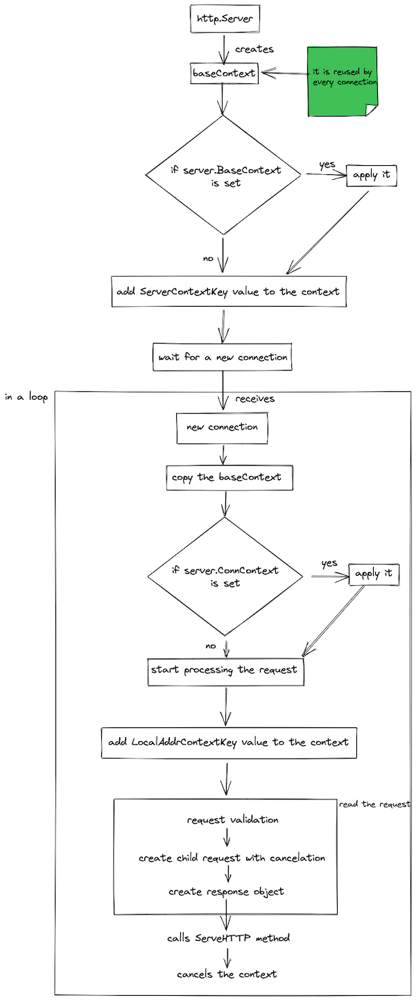

Some time ago, I found a [Stack Overflow question](https://stackoverflow.com/questions/29879036/go-websocket-server-use-of-closed-network-connection). The author had a problem with understanding why the context from the request he's using is canceled. I remember that I had a similar situation in the past: I used the context from the HTTP request and tried to use it in background operation and return the response to the user before it was finished. This issue comes from not understanding how the context is used in the `http.Server` struct. I want to save you from similar surprises. I described it in this article.

When the server starts, it calls the `Server.Serve(l net.Listener)` method from `net/http` package. We start with the base context: `baseCtx := context.Background()` [^1]. It's used as the foundation for all contexts in incoming requests. In the next step, a key `http.ServerContextKey` is added to the context with the value of type `*http.Server` - the current server. Thanks to this, you can get the instance of the server that executed your HTTP handler.

The server's waiting for new connections. When it gets one, it copies the base context and calls `srv.ConnContext`[^2] on the new one. It can modify the current context instance per connection. From now, everything is running in parallel.

The `(c *conn) serve(ctx context.Context)` method adds `http.LocalAddrContextKey` key to the context with the value of the local address of the underlying network connection. It can be used to access the local address the connection arrived at. Here's an example of a handler that prints the address:

```go
http.HandleFunc("/", func(w http.ResponseWriter, r *http.Request) {
	srvAddr := r.Context()(http.LocalAddrContextKey).(net.Addr)
	fmt.Println(srvAddr)
})
```

After adding some timeouts and validating the request it creates another context but with cancelation. The cancelation is deferred. It means after finishing processing the request, the context will be canceled. Next, a `func (c *conn) readRequest(ctx context.Context) (w *response, err error)` is called. This method reads the request from the client and, as you may guess, creates a child context with cancelation.

Here's an interesting part: the context created here is passed to the request struct. You can get exactly this context instance using the `r.Context()` method.

The cancelation method goes to the response struct.

```go
	ctx, cancelCtx := context.WithCancel(ctx)
	req.ctx = ctx
	// ...

	w = &response{
		conn:          c,
		cancelCtx:     cancelCtx,
		req:           req,

		// ...
	}
```

After some error checks, the request goes to the `ServeHTTP` that calls your handler. When the handler exits, the context inside the request is canceled.

```go
serverHandler{c.server}.ServeHTTP(w, w.req)
w.cancelCtx()
```

## Diagram

To help you understand the whole process, I created a diagram with all the steps in a more visual form.



## Using context from the request in background operations
The last fact has a consequence and may lead to a hard to debug an issue. Let's consider a situation that you want to read the request, do a validation, process it in parallel, and return a response to the client immediately. When you reuse the context from the request, the processing part will fail with the `context canceled` error. It will happen because when the background operation will start executing, the context it's using will be already canceled.

To fix that, you have to create a new context from the `context.Background()` and use it instead. Don't forget to add some timeouts!

# Summary

Right now, you should understand from the context in the request comes from. Knowing it isn't crucial but may save you from some bugs.

[^1]: The base context can be changed using `Server.BaseContext` field. It's useful when you want to replace the `context.Background()` value with your own. 
[^2]: if it's set, of course
