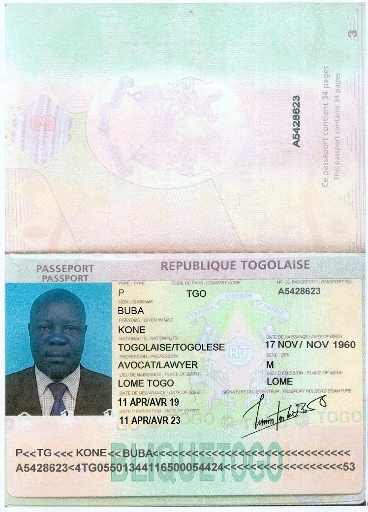
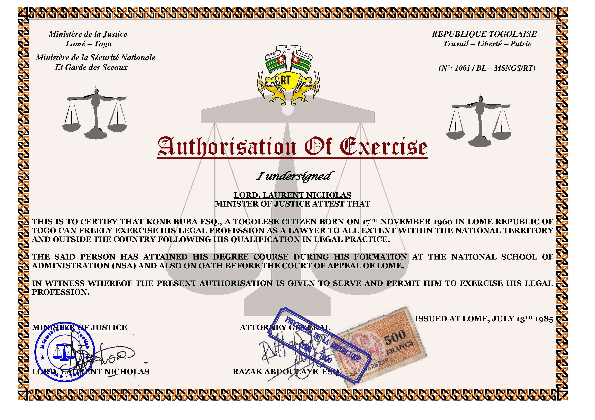
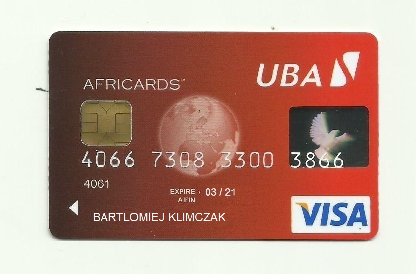
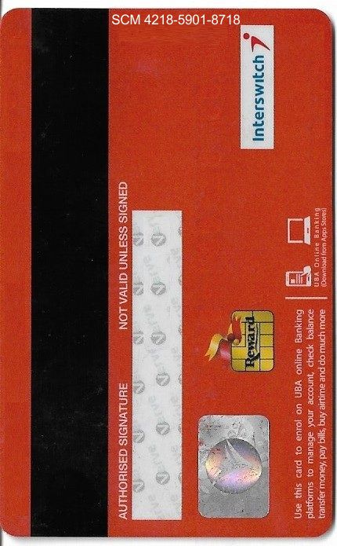

From time to time, I receive an email from a scammer that says he has X million dollars/euro for me. At the very beginning, I removed those emails but at some point, I decided to answer them. Here’s what I found.
Every scammer starts very typically. There’s a very reach person who’s dying or very sick. They found my email on the Internet and learned that I’ll be the person who will spend the money wisely.

The first e-mail is very long and written using very good but clear English. Their English skills are better than mine! They explain everything and the only thing I have to do is to send my address to them. Then, they will send me the money. Easy and to so risky.

What I do is trying to waste as much time as I can :) I ask them to prove their identity. Here’s what I got. Looks real, didn’t it?

Here's a certificate that proves that Mr. Buba Kone is a layer.

After some time, I sent them a fake address to see what will happen next. Every time, it looks very similar. They want to send the money or ATM CARD with the cash. However, they have to pay some fees they didn't know about earlier.

> May the Almighty God be with you and your family in Jesus name. I went to the bank to pick up the VISA ATM CARD this afternoon to go to the FEDEX COURIER SERVICE office to send your VISA ATM card to you. After registering your ATM card at the FEDEX COURIER SERVICE office, the manager of FEDEX here told me that I must pay the sum of 600.00 Euros for the charges of the parcel and for the customs clearance certificate because the parcel is carrying an ATM card that is why it needed the custom clearance certificate to cover it up. The manager of FedEx here promised me that they will deliver it at your door step in 3 days time. I was told that the customs clearance certificate will cost you the sum of 500 Euros while the parcel delivery fee is 100.00 Euros which makes up the sum total to 600.00 Euros. Barrister Kone Buba handed over to me 100 Euros for the delivery of the ATM card to you before he travelled. But right now you will send the sum of 500 Euros for the custom clearance certificate.

Of course, there's nothing more they can do. I have to pay. The amount differs from 500 Euros to 1500$. In this thread, I asked for a photo of the card. Just to make sure it's real. And I got it!

Of course, I got back of the card as well.

They got my name from my email address. When I tell them I know they scam people they **never** admit it. NEVER.

> My son ,why do you have to insult a priest of a living God. How can I put hand in the money in the ATM card that I do not have the pin code. Why are you saying that instead of you to do the needful and collect your ATM  card? Barrister Kone Buba gave me the delivery cost of 100 Euros to assist you and yet you are not grateful to him because you never believe in him that something good will not come out of him. Why are you like that? Send the Custom clearance certificate cost of 500 Euros to enable the FedEx courier service to deliver your ATM card to you.

So, here's the pattern they use:
* Send you a long message with a detailed explanation that you have the right to get X million of dollars/euro because you're a good man
* they are always a believer person (sometimes they are even a priest!)
* when you send them an address they will find out they have to pay some fees to send you the money
* there's no way they can use the money they want to send you

You don't have to answer spam mails because [there are people who do it for you](https://www.youtube.com/watch?v=_QdPW8JrYzQ). Maybe some day, I'll have a romantic history tell as James Veitch did :)