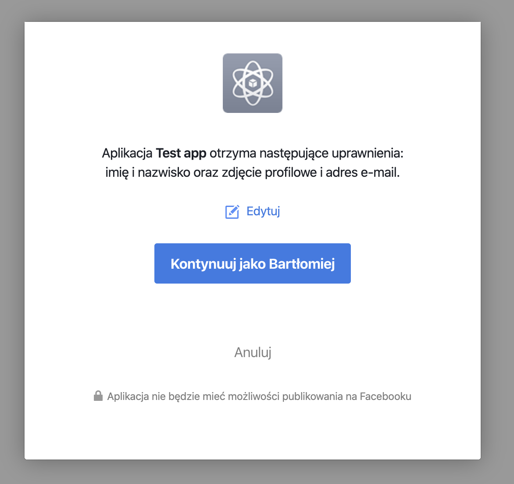

OAuth 2.0 is the industry-standard protocol for authorization. Go has built-in support for this protocol and today we’ll build a simple application. The application will use the Facebook API to authorize a user.

If you need to clarify what oauth2 is and how it works you can take a look at [the introduction from DigitalOcean](https://www.digitalocean.com/community/tutorials/an-introduction-to-oauth-2). There are some [videos as well](https://www.youtube.com/watch?v=CPbvxxslDTU).

The very first step of building our program is creating a new Facebook application. You can do it in [Facebook for Developers](https://developers.facebook.com/). Please remember to choose the platform Website while creating. What’s more, any other application on Twitter or LinkedIn will be fine as well. I use Facebook as an example.

Once the application is created, go to the Basic tab and copy AppID and AppSecret. We will need them a bit later. Another pre-step is configuring domains. We will use our local machine, so we put `http://localhost` to `Site URL` field as well as `App Domains`.

In the library, we have a package called `golang.org/x/oauth2` and the package will help us build the application quickly. First of all, we need a configuration.

```go
conf := &oauth2.Config{
    ClientID:     envOrPanic("CLIENT_ID"),
    ClientSecret: envOrPanic("CLIENT_SECRET"),
    RedirectURL:  "http://localhost/oauth",
    Scopes:       []string{"email"},
    Endpoint:     endpoints.Facebook,
}
```

Im the environment variables the client’s ID and secret. The redirect URL is set to `http://localhost/oauth`. The address should be in the domain we specified in the Facebook console. Because we just need to know some basic information about the user (id and email) we choose the scope `email`.

The `oauth2` package contains a subpackage with about 34 pre-defined endpoints, which covers the most popular services that support OAuth. Of course, Facebook is one of them. You can see the full list [in the docs](https://pkg.go.dev/golang.org/x/oauth2@v0.0.0-20200107190931-bf48bf16ab8d/endpoints?tab=doc).

We define two HTTP handlers. The first one points to `/` (root). When a user visits the page they will see a link for the application authorization. After visiting the link, they are redirected to Facebook’s page where they can confirm authorization. After the confirmation, the user is redirected to the `/oauth` page where the one time token is exchanged for the access token. Let’s take a look at the first endpoint.

```go
func (h oauthHandler) auth(w http.ResponseWriter, r *http.Request) {
    url := h.conf.AuthCodeURL("state", oauth2.AccessTypeOffline)
    body := fmt.Sprintf(`<p>To authenticate please <a href="%v">click here</a></p>`, url)
    w.Header().Set("Content-Type", "text/html; charset=utf-8")
    io.WriteString(w, body)
}
```

We generate the auth token which is used to redirect the end-user to the Facebook page. At this point, the user has to accept the authorization.



After that, the user is redirected to the `/oauth` endpoint with a one-time code in the URL. After exchanging it for the access token (which should be saved for future use, we can start calling the Facebook API to get the data we need.

```go
func (h oauthHandler) handleCode(w http.ResponseWriter, r *http.Request) {
    ctx := r.Context()
    code := r.URL.Query()["code"][0]
    tok, err := h.conf.Exchange(ctx, code)
    if err != nil {
        log.Fatal(err)
    }

    client := h.conf.Client(ctx, tok)
    resp, err := client.Get("https://graph.facebook.com/me?access_token=" + url.QueryEscape(tok.AccessToken))
    if err != nil {
        log.Fatal(err)
    }
    defer resp.Body.Close()
    body, err := ioutil.ReadAll(resp.Body)
    if err != nil {
        log.Fatal(err)
    }
    io.WriteString(w, string(body))
}
```

In the example above, we ask for the user’s information and pass them to him directly as the response. And that’s it! We built a simple integration with Facebook. Thank’s to the standard library, our code is minimal. Further integrations will be straightforward and almost identical. The only differences should be scopes (you have to check the API docs which of them can be used).

This article was written by reader’s request. If you have any idea for a blog post, you can contact me [by email](mailto:bklimczak@developer20.com) or in the comments section below. I'm doing it for you so any feedback is welcomed :)
