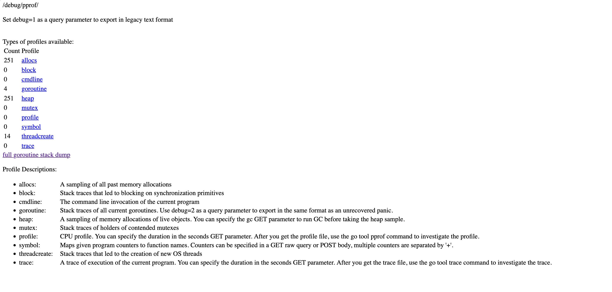
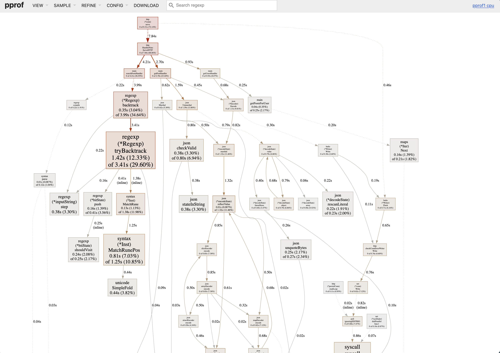
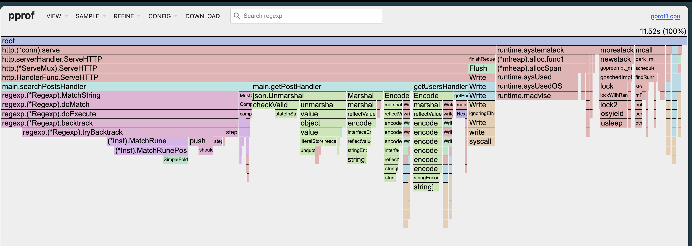
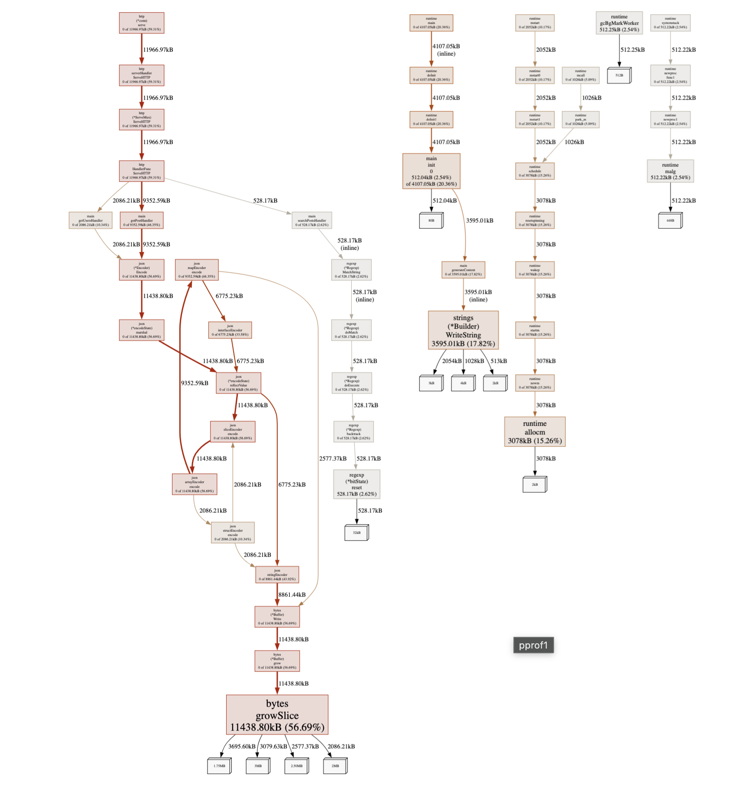
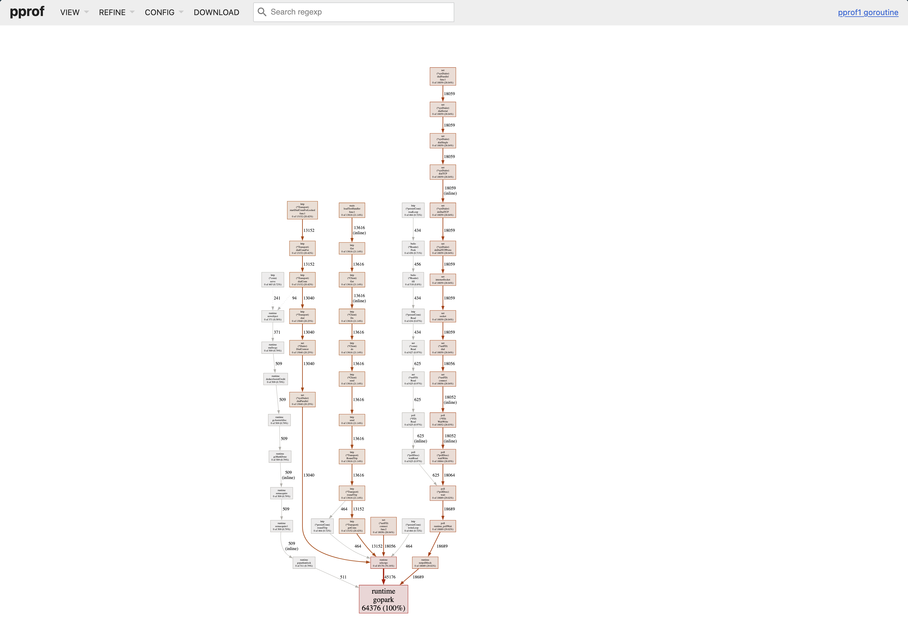

I spent two weeks optimizing a function that accounted for 0.3% of my program's runtime. Meanwhile, a JSON unmarshaling call that ran in a loop was eating 45% of CPU time. I just didn't know it.

This happens more often than you'd think. We optimize based on gut feeling, not data. We assume the database query is slow. We assume the algorithm is the problem. We're usually wrong.

pprof is Go's profiling tool. It's built into the runtime, requires minimal setup, and answers the question: "Where is my program actually spending time?" Not where you think it's spending time. Where it actually is.

## What pprof Does

Three main things:

1. **Shows where CPU time goes** - Which functions are hot
2. **Shows where memory goes** - What's allocating and how much
3. **Shows where goroutines are stuck** - What's blocking

There are other profile types (block, mutex, etc.), but these three solve most problems. We'll cover the rest in later parts.

## The 3-Line Setup

If you're running any kind of service, add this:

```go
package main

import (
    "net/http"
    _ "net/http/pprof"
)

func main() {
    go startYourApplication()
    
    http.ListenAndServe("localhost:6060", nil)
}
```

The blank import registers handlers at `/debug/pprof/`. That's it.

Run your program, visit `http://localhost:6060/debug/pprof/`. You'll see available profiles.



**One important note**: Don't expose this to the public internet. Bind to localhost or put it behind auth. Profiles contain information about your code structure, and generating them uses resources.

## CPU Profiling

Your service is slow. Where's the time going?

### Collecting a Profile

```bash
go tool pprof http://localhost:6060/debug/pprof/profile?seconds=30
```

This tells your program to profile CPU usage for 30 seconds, downloads the result, and drops you into an interactive prompt.

You'll see:

```
Fetching profile over HTTP from http://localhost:6060/debug/pprof/profile?seconds=30
Saved profile in /Users/you/pprof/pprof.samples.cpu.001.pb.gz
Type: cpu
Duration: 30.13s, Total samples = 27.5s (91.3%)
Entering interactive mode (type "help" for commands)
(pprof)
```

### Reading the Profile

Type `top`:

```
(pprof) top
      flat  flat%   sum%        cum   cum%
     4.20s 15.27% 15.27%      8.50s 30.91%  runtime.scanobject
     2.80s 10.18% 25.45%      2.80s 10.18%  runtime.memmove
     1.50s  5.45% 37.82%     12.30s 44.73%  main.processRequest
     1.20s  4.36% 46.91%      3.40s 12.36%  encoding/json.Unmarshal
     0.90s  3.27% 50.18%      5.20s 18.91%  main.parseData
```

Two columns matter:

- **flat**: Time spent in the function itself
- **cum**: Time spent in the function plus everything it calls

Look at `main.processRequest`. Flat is 1.50s (5.45%) but cumulative is 12.30s (44.73%). The function itself is fast. Something it calls is slow.

Compare with `runtime.scanobject`. Flat is 4.20s. That's actual work, not delegation.

This distinction matters. If you optimize `processRequest` directly, you might get 5% improvement. If you optimize what it calls, you could get 45%.

### The Web UI

The terminal view works, but the web UI is better:

```bash
go tool pprof -http=:8080 http://localhost:6060/debug/pprof/profile?seconds=30
```



Opens your browser with multiple views. The most useful: flame graph.

Click VIEW → Flame Graph.



Width equals time. The wider the box, the more time spent there. You can spot hot paths immediately. No mental math.

Colors just distinguish packages. They don't mean anything else.

### What to Look For

In the flame graph or graph view:

1. **Wide sections in your code** - Optimization targets
2. **Unexpected stdlib calls** - Like `encoding/json` taking 20% (maybe you're parsing JSON in a loop?)
3. **GC overhead** - Functions starting with `runtime.` related to garbage collection

Common patterns:

**String concatenation in loops**:
```go
// This allocates on every iteration
result := ""
for _, item := range items {
    result += item
}

// Pre-allocate instead
var builder strings.Builder
builder.Grow(estimatedSize)
for _, item := range items {
    builder.WriteString(item)
}
```

**JSON marshaling in hot paths**:
```go
// Called millions of times
func handler(w http.ResponseWriter, r *http.Request) {
    data := getData()
    json.Marshal(data) // Expensive
}
```

**Regex compilation in loops**:
```go
// Recompiled every iteration
for _, line := range lines {
    re := regexp.MustCompile(`pattern`)
    re.MatchString(line)
}

// Compile once
var re = regexp.MustCompile(`pattern`)

func process(lines []string) {
    for _, line := range lines {
        re.MatchString(line)
    }
}
```



## Memory Profiling

CPU is one thing. Memory is different.

### Collecting a Memory Profile

```bash
go tool pprof -http=:8080 http://localhost:6060/debug/pprof/heap
```

Opens the web UI immediately with current heap state.



### The Four Metrics

Memory profiles show four metrics. This confuses everyone initially:

1. **alloc_space**: Total bytes allocated (even if later freed)
2. **alloc_objects**: Total number of allocations
3. **inuse_space**: Bytes currently allocated (not freed yet)
4. **inuse_objects**: Objects currently allocated

Switch between them in the SAMPLE dropdown.

**For finding leaks**: Use `inuse_space` or `inuse_objects`  
**For reducing GC pressure**: Use `alloc_space` or `alloc_objects`

### Finding Memory Leaks

Memory leaks in Go aren't traditional leaks. They're usually "keeping references to things we shouldn't."

Real example I debugged:

```go
var cache = make(map[string]*UserSession)

func getSession(id string) *UserSession {
    if session, ok := cache[id]; ok {
        return session
    }
    
    session := &UserSession{id: id}
    cache[id] = session // Never removed
    return session
}
```

Every session stays in the map forever. Over days, this grows to gigabytes.

To find this, take two heap profiles with time between them:

```bash
# First profile
curl http://localhost:6060/debug/pprof/heap > heap1.prof

# Wait 30 minutes
# Second profile
curl http://localhost:6060/debug/pprof/heap > heap2.prof

# Compare
go tool pprof -http=:8080 -base=heap1.prof heap2.prof
```

The `-base` flag shows the difference. Functions with memory growth appear at the top.

### Reducing Allocations

High allocation rate means GC pressure. GC pressure means latency spikes.

**Unnecessary conversions**:
```go
// Converts string to []byte
func process(s string) {
    data := []byte(s) // Allocation
    hash := sha256.Sum256(data)
}
```

**Growing slices**:
```go
// Slice grows multiple times
var results []Result
for item := range items {
    results = append(results, process(item))
}

// Pre-allocate if you know the size
results := make([]Result, 0, len(items))
for item := range items {
    results = append(results, process(item))
}
```

**Interface boxing**:
```go
// Each number boxed into interface{}
func sum(numbers []interface{}) int {
    total := 0
    for _, n := range numbers {
        total += n.(int)
    }
    return total
}

// Use concrete types or generics
func sum(numbers []int) int {
    total := 0
    for _, n := range numbers {
        total += n
    }
    return total
}
```

## Goroutine Profiling

Your program has 50,000 goroutines. Normal? Let's check.

```bash
go tool pprof -http=:8080 http://localhost:6060/debug/pprof/goroutine
```


Shows where goroutines are created and what they're doing.

Common issues:

**HTTP client without timeout**:
```go
// No timeout, goroutine can block forever
resp, err := http.Get(url)

// With timeout
client := &http.Client{Timeout: 10 * time.Second}
resp, err := client.Get(url)
```

**Channel without receiver**:
```go
// If no one reads, sender blocks forever
func worker() {
    ch := make(chan int)
    go func() {
        ch <- 42 // Blocks
    }()
}

// Buffered or ensure receiver
ch := make(chan int, 1)
go func() {
    ch <- 42
}()
```

**Missing WaitGroup.Done()**:
```go
var wg sync.WaitGroup
wg.Add(1)
go func() {
    doWork()
    // Forgot wg.Done()
}()
wg.Wait() // Waits forever
```

If you see thousands of goroutines stuck in the same place, that's your bug.



## Real Example

Last year I had an API endpoint with 2-second p99 response times.

### Collected CPU Profile

```bash
go tool pprof -http=:8080 http://localhost:6060/debug/pprof/profile?seconds=30
```

Flame graph showed 40% of time in `json.Marshal`.

The code:

```go
func getUsers(w http.ResponseWriter, r *http.Request) {
    users := db.GetAllUsers()
    
    for i := range users {
        users[i].Posts = db.GetUserPosts(users[i].ID)
        users[i].Comments = db.GetUserComments(users[i].ID)
    }
    
    json.NewEncoder(w).Encode(users)
}
```

Two problems:
1. N+1 queries
2. Marshaling huge objects

### Fixed It

```go
func getUsers(w http.ResponseWriter, r *http.Request) {
    users := db.GetAllUsers()
    
    userIDs := make([]int, len(users))
    for i, u := range users {
        userIDs[i] = u.ID
    }
    
    postsMap := db.GetPostsForUsers(userIDs)
    commentsMap := db.GetCommentsForUsers(userIDs)
    
    for i := range users {
        users[i].Posts = postsMap[users[i].ID]
        users[i].Comments = commentsMap[users[i].ID]
    }
    
    json.NewEncoder(w).Encode(users)
}
```

Result: 2s → 200ms.

But heap profile showed 50MB allocated per request. Each `User` had full `Posts` and `Comments`. For a listing endpoint, we only needed counts.

Final version:

```go
type UserListItem struct {
    ID           int    `json:"id"`
    Name         string `json:"name"`
    PostCount    int    `json:"post_count"`
    CommentCount int    `json:"comment_count"`
}

func getUsers(w http.ResponseWriter, r *http.Request) {
    users := db.GetUserSummaries()
    json.NewEncoder(w).Encode(users)
}
```

Result: 200ms → 50ms, 50MB → 500KB per request.

## The Process

How I use pprof for any performance issue:

1. Reproduce the problem
2. Profile while it's happening (30-60 seconds for CPU)
3. Look at flame graph - find wide sections
4. Check if it's your code or stdlib/runtime
5. Fix the most obvious thing
6. Profile again with `-base` to compare
7. Repeat

For memory:
1. Is it a leak or just high usage?
2. If leak: compare two profiles with `-base`
3. If high usage: look at `alloc_space` for hotspots
4. Fix allocations or add limits

## Common Mistakes

**Profiling in development mode**: Always use `go build`, not `go run`. Profile with optimizations enabled.

**Profile duration too short**: 30 seconds minimum for CPU. Shorter profiles are noisy.

**Profiling the wrong thing**: If slow under load, profile under load. Not an idle service.

**Optimizing flat instead of cumulative**: High flat means the function itself is slow. High cumulative means something it calls is slow.

**Not comparing before/after**: Keep the old profile. Use `-base` to verify your changes worked.

## When pprof Isn't Enough

pprof is great for CPU and memory, but doesn't show:

- **I/O wait time** - pprof shows on-CPU time, not waiting
- **Lock contention** - use block and mutex profiles (covered later)
- **GC pauses** - use `go tool trace`
- **System call latency** - pprof shows syscalls but not their duration

For those cases, you need other tools.

## What's Next

This covers the basics:
- CPU profiling (where time goes)
- Heap profiling (where memory goes)
- Goroutine profiling (where goroutines are stuck)

In the next parts:
- **Part 2**: CPU profiling internals, how sampling works
- **Part 3**: Memory profiling internals, leak detection patterns
- **Part 4**: Block and mutex profiling, finding contention
- **Part 5**: Production profiling, continuous profiling

But this article solves 90% of problems. Master this first.

## Final Thought

pprof should be your first tool, not your last resort. When something's slow, don't guess. Profile. Look at data. Fix what the data shows.

I've wasted too much time optimizing code that didn't matter while the real bottleneck sat in some innocent-looking function that ran a million times per second.

Measure, then optimize.
