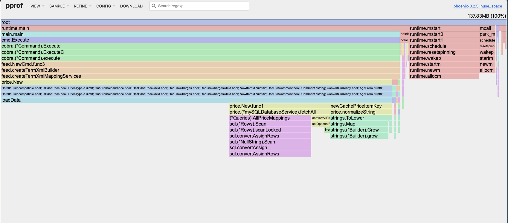

*This is Part 2 of the pprof series. If you're new to pprof, start with [Part 1: Quick Start]().*

Last week I had a service that was "slow." The recommendation endpoint was taking around 28ms per request. Not terrible, but not great either. Management wanted it faster.

I could have guessed. Maybe the database? Maybe JSON serialization? Maybe string operations? All reasonable guesses. All probably wrong.

So I profiled it. The results surprised me.

## The Setup

Before we dive into the data, here's what I was working with: a content recommendation service that analyzes articles and finds similar ones. The `/recommend` endpoint was the slow one. It needs to:

1. Load an article
2. Compare it with 200 other articles
3. Calculate similarity scores
4. Return the top 10 matches

Simple enough. But 28ms seemed high for what should be straightforward operations.

<details>
<summary>Full source code (click to expand)</summary>

```go
package main

import (
	"compress/gzip"
	"crypto/sha256"
	"encoding/json"
	"fmt"
	"log"
	"math"
	"net/http"
	_ "net/http/pprof"
	"sort"
	"strings"
	"sync"
	"time"
)

type Article struct {
	ID      string   `json:"id"`
	Title   string   `json:"title"`
	Content string   `json:"content"`
	Author  string   `json:"author"`
	Tags    []string `json:"tags"`
	Views   int      `json:"views"`
	Likes   int      `json:"likes"`
}

type AnalyticsResult struct {
	ArticleID       string   `json:"article_id"`
	ReadingTime     int      `json:"reading_time_minutes"`
	Complexity      float64  `json:"complexity_score"`
	Keywords        []string `json:"keywords"`
	RelatedArticles []string `json:"related_articles"`
	Compressed      string   `json:"compressed_preview"`
	Signature       string   `json:"signature"`
	ProcessingMs    int64    `json:"processing_ms"`
}

var (
	articles []Article
	cache    = make(map[string]AnalyticsResult)
	cacheMu  sync.RWMutex
)

func init() {
	topics := []string{
		"Golang has excellent concurrency primitives with goroutines and channels",
		"Database indexing strategies can significantly improve query performance",
		"Microservices architecture provides flexibility but introduces complexity",
		"Machine learning models require careful feature engineering",
		"Container orchestration with Kubernetes enables scalable deployment",
	}
	authors := []string{"Alice", "Bob", "Charlie", "Diana", "Eve"}

	for i := 0; i < 200; i++ {
		content := ""
		for j := 0; j < 5+i%10; j++ {
			content += topics[j%len(topics)] + ". "
		}
		articles = append(articles, Article{
			ID:      fmt.Sprintf("article-%d", i),
			Title:   fmt.Sprintf("Article %d: Advanced Topics", i),
			Content: content,
			Author:  authors[i%len(authors)],
			Tags:    []string{"golang", "programming", "architecture"},
			Views:   1000 + i*100,
			Likes:   50 + i*5,
		})
	}
}

func recommendHandler(w http.ResponseWriter, r *http.Request) {
	articleID := r.URL.Query().Get("id")
	if articleID == "" {
		articleID = "article-0"
	}

	var article *Article
	for i := range articles {
		if articles[i].ID == articleID {
			article = &articles[i]
			break
		}
	}

	if article == nil {
		http.Error(w, "article not found", http.StatusNotFound)
		return
	}

	start := time.Now()
	recommendations := findSimilarArticles(*article, 10)
	processingMs := time.Since(start).Milliseconds()

	response := map[string]interface{}{
		"article_id":      articleID,
		"recommendations": recommendations,
		"processing_ms":   processingMs,
	}

	w.Header().Set("Content-Type", "application/json")
	json.NewEncoder(w).Encode(response)
}

// Problem: N² similarity comparison
func findSimilarArticles(article Article, limit int) []string {
	type similarity struct {
		id    string
		score float64
	}

	var similar []similarity

	for _, other := range articles {
		if other.ID == article.ID {
			continue
		}
		score := calculateSimilarity(article, other)
		similar = append(similar, similarity{other.ID, score})
	}

	sort.Slice(similar, func(i, j int) bool {
		return similar[i].score > similar[j].score
	})

	result := make([]string, 0, limit)
	for i := 0; i < limit && i < len(similar); i++ {
		result = append(result, similar[i].id)
	}
	return result
}

// Problem: Expensive similarity calculation
func calculateSimilarity(a1, a2 Article) float64 {
	// Create word sets (inefficient - done on every call)
	words1 := strings.Fields(strings.ToLower(a1.Content))
	words2 := strings.Fields(strings.ToLower(a2.Content))

	// Count common words (nested loops - O(n*m))
	common := 0
	for _, w1 := range words1 {
		for _, w2 := range words2 {
			if w1 == w2 {
				common++
				break
			}
		}
	}

	wordScore := float64(common) / math.Max(float64(len(words1)), float64(len(words2)))
	return wordScore * 100
}

func main() {
	http.HandleFunc("/recommend", recommendHandler)

	log.Println("Server starting on :8080")
	log.Println("pprof available at http://localhost:8080/debug/pprof/")
	log.Fatal(http.ListenAndServe(":8080", nil))
}
```

</details>

## Collecting the Profile

While hitting the endpoint with load, I collected a 30-second CPU profile:

```bash
curl http://localhost:8080/debug/pprof/profile?seconds=30 > cpu.prof
```

Then opened it:

```bash
go tool pprof -http=:9090 cpu.prof
```

The web UI gives you multiple views. Let's walk through each one.

## The Flame Graph - Your First Stop

The flame graph is where you start. It shows the call stack horizontally, with width representing time spent. Here's what mine looked like:



Immediately obvious: there's a massive block in the middle. The wide sections are where time goes. Everything else is noise.

Looking closer at the flame graph, I can see:
- `runtime.systemstack` takes up half the width - that's Go runtime overhead
- `net/http` handling is there but not dominant
- There's a chunk of my code (`main.*` functions) but it's not the widest part

The flame graph gives you intuition. But you need numbers to know what to fix.

## The Top View - Raw Numbers

Switch to the Top view in the web UI or run:

```bash
go tool pprof -top cpu.prof
```

Here's what I got:

```
File: pprof2
Type: cpu
Time: 2026-01-30 14:26:44 CET
Duration: 30.13s, Total samples = 1.62s ( 5.38%)
Showing nodes accounting for 1.62s, 100% of 1.62s total
      flat  flat%   sum%        cum   cum%
     0.68s 41.98% 41.98%      0.68s 41.98%  syscall.syscall
     0.46s 28.40% 70.37%      0.46s 28.40%  runtime.kevent
     0.10s  6.17% 76.54%      0.10s  6.17%  runtime.pthread_cond_wait
     0.10s  6.17% 82.72%      0.10s  6.17%  runtime.pthread_kill
     0.05s  3.09% 85.80%      0.05s  3.09%  runtime.madvise
     0.05s  3.09% 88.89%      0.05s  3.09%  runtime.pthread_cond_signal
     0.03s  1.85% 90.74%      0.09s  5.56%  main.calculateSimilarity
     0.02s  1.23% 91.98%      0.02s  1.23%  runtime.stealWork
     0.01s  0.62% 92.59%      0.01s  0.62%  internal/runtime/atomic.(*Uint32).Load (inline)
     0.01s  0.62% 93.21%      0.01s  0.62%  runtime.asyncPreempt
     0.01s  0.62% 93.83%      0.01s  0.62%  runtime.findObject
     0.01s  0.62% 94.44%      0.14s  8.64%  runtime.findRunnable
     0.01s  0.62% 95.06%      0.03s  1.85%  runtime.goschedImpl
     0.01s  0.62% 95.68%      0.01s  0.62%  runtime.memclrNoHeapPointers
     0.01s  0.62% 96.30%      0.01s  0.62%  runtime.memequal
     0.01s  0.62% 96.91%      0.01s  0.62%  runtime.pollWork
     0.01s  0.62% 97.53%      0.02s  1.23%  runtime.scanobject
     0.01s  0.62% 98.15%      0.01s  0.62%  runtime.typePointers.next
     0.01s  0.62% 98.77%      0.01s  0.62%  sort.partition_func
     0.01s  0.62% 99.38%      0.03s  1.85%  strings.Fields
     0.01s  0.62%   100%      0.01s  0.62%  syscall.syscall6
         0     0%   100%      0.64s 39.51%  bufio.(*Writer).Flush
```

Wait. My code (`main.calculateSimilarity`) shows only 0.03s flat (1.85%) but 0.09s cumulative (5.56%). What does this mean?

## Understanding Flat vs Cumulative

This is critical. Let me break it down:

- **Flat (self) time**: Time spent in the function's own code
- **Cumulative time**: Time spent in the function + everything it calls

Look at `main.calculateSimilarity`:
- Flat: 0.03s (1.85%) - barely any time in the function itself
- Cumulative: 0.09s (5.56%) - significant time including callees

This tells me the function is fast, but something it calls is slow.

Now look at `syscall.syscall`:
- Flat: 0.68s (41.98%)
- Cumulative: 0.68s (41.98%)

Flat equals cumulative. This function IS the work. It's not delegating. Most of that is I/O - writing HTTP responses back to clients.

## Finding the Real Bottleneck

Let's look at cumulative time sorted:

```bash
go tool pprof -top -cum cpu.prof
```

```
File: pprof2
Type: cpu
Time: 2026-01-30 14:26:44 CET
Duration: 30.13s, Total samples = 1.62s ( 5.38%)
Showing nodes accounting for 1.62s, 100% of 1.62s total
      flat  flat%   sum%        cum   cum%
         0     0%     0%      0.77s 47.53%  net/http.(*conn).serve
     0.68s 41.98% 41.98%      0.68s 41.98%  syscall.syscall
         0     0% 41.98%      0.64s 39.51%  bufio.(*Writer).Flush
         0     0% 41.98%      0.64s 39.51%  internal/poll.(*FD).Write
         0     0% 41.98%      0.64s 39.51%  internal/poll.ignoringEINTRIO (inline)
         0     0% 41.98%      0.64s 39.51%  net.(*conn).Write
         0     0% 41.98%      0.64s 39.51%  net.(*netFD).Write
         0     0% 41.98%      0.64s 39.51%  net/http.(*response).finishRequest
         0     0% 41.98%      0.64s 39.51%  net/http.checkConnErrorWriter.Write
         0     0% 41.98%      0.64s 39.51%  runtime.systemstack
         0     0% 41.98%      0.64s 39.51%  syscall.Write (inline)
         0     0% 41.98%      0.64s 39.51%  syscall.write
     0.46s 28.40% 70.37%      0.46s 28.40%  runtime.kevent
         0     0% 70.37%      0.44s 27.16%  runtime.gcStart.func4
         0     0% 70.37%      0.44s 27.16%  runtime.netpoll
         0     0% 70.37%      0.44s 27.16%  runtime.startTheWorldWithSema
         0     0% 70.37%      0.15s  9.26%  runtime.schedule
     0.01s  0.62% 70.99%      0.14s  8.64%  runtime.findRunnable
         0     0% 70.99%      0.13s  8.02%  runtime.mcall
         0     0% 70.99%      0.12s  7.41%  runtime.park_m
         0     0% 70.99%      0.11s  6.79%  runtime.gcBgMarkWorker.func2
         0     0% 70.99%      0.11s  6.79%  runtime.gcDrain
         0     0% 70.99%      0.10s  6.17%  main.findSimilarArticles
         0     0% 70.99%      0.10s  6.17%  main.recommendHandler
         0     0% 70.99%      0.10s  6.17%  net/http.(*ServeMux).ServeHTTP
         0     0% 70.99%      0.10s  6.17%  net/http.HandlerFunc.ServeHTTP
         0     0% 70.99%      0.10s  6.17%  net/http.serverHandler.ServeHTTP
         0     0% 70.99%      0.10s  6.17%  runtime.gcDrainMarkWorkerDedicated (inline)
```

Now we're getting somewhere. `main.findSimilarArticles` has 0.10s cumulative (6.17%), and `calculateSimilarity` has 0.09s cumulative (5.56%). This means `findSimilarArticles` calls `calculateSimilarity`, and that's where most of its time goes.

Let's look at the call relationship:

```bash
go tool pprof cpu.prof
(pprof) peek findSimilarArticles
```

```
----------------------------------------------------------+-------------
      flat  flat%   sum%        cum   cum%   calls calls% + context
----------------------------------------------------------+-------------
                                             0.10s   100% |   main.recommendHandler
         0     0%     0%      0.10s  6.17%                | main.findSimilarArticles
                                             0.09s 90.00% |   main.calculateSimilarity
                                             0.01s 10.00% |   sort.Slice
----------------------------------------------------------+-------------
```

This shows:
- `findSimilarArticles` is called by `recommendHandler` (100% of calls in this profile)
- 90% of its time is spent in `calculateSimilarity`
- 10% is spent sorting the results

## Looking at the Source Code

Now let's see what `calculateSimilarity` actually does:

```bash
go tool pprof -list=main.calculateSimilarity cpu.prof
```

```
ROUTINE ======================== main.calculateSimilarity in pprof2.go
      30ms       90ms (flat, cum)  5.56% of Total
         .       10ms    389:func calculateSimilarity(a1, a2 Article) float64 {
         .          .    390:	// Create word sets (inefficient)
         .       10ms    391:	words1 := strings.Fields(strings.ToLower(a1.Content))
         .       20ms    392:	words2 := strings.Fields(strings.ToLower(a2.Content))
         .          .    393:
         .          .    394:	// Count common words (nested loops)
         .          .    395:	common := 0
         .          .    396:	for _, w1 := range words1 {
      30ms       40ms    397:		for _, w2 := range words2 {
         .       10ms    398:			if w1 == w2 {
         .          .    399:				common++
         .          .    400:				break
         .          .    401:			}
         .          .    402:		}
         .          .    403:	}
```

Line 391: 10ms in `strings.Fields` and `strings.ToLower`
Line 392: 20ms doing the same thing again
Line 397-398: 50ms in nested loops comparing strings

Total: 90ms cumulative. That's 5.56% of the profile's CPU time - but remember, the profile only captured 1.62s of actual CPU work during the 30-second window.

## The Graph View - Seeing Relationships

The graph view shows the call relationships visually:


You can see:
- `main.calculateSimilarity` is called from `findSimilarArticles`
- It calls `strings.ToLower` and `strings.Fields` repeatedly
- The edges show how much time flows through each call path

The thickness of edges matters. Thick edge = lots of time.

## What About strings.Fields?

Let's look deeper at what `strings.Fields` is doing:

```bash
go tool pprof -list=strings.Fields cpu.prof
```

```
ROUTINE ======================== strings.Fields in strings/strings.go
      10ms       30ms (flat, cum)  1.85% of Total
         .          .    384:func Fields(s string) []string {
         .          .    385:	// First count the fields.
         .          .    386:	// This is an exact count if s is ASCII, otherwise it is an approximation.
         .          .    387:	n := 0
         .          .    388:	wasSpace := 1
         .          .    389:	// setBits is used to track which bits are set in the bytes of s.
         .          .    390:	setBits := uint8(0)
         .          .    391:	for i := 0; i < len(s); i++ {
         .          .    392:		r := s[i]
         .          .    393:		setBits |= r
      10ms       10ms    394:		isSpace := int(asciiSpace[r])
         .          .    395:		n += wasSpace & ^isSpace
         .          .    396:		wasSpace = isSpace
         .          .    397:	}
         .          .    ...
         .       10ms    404:	a := make([]string, n)
         .          .    ...
         .       10ms    418:		a[na] = s[fieldStart:i]
```

`strings.Fields` is scanning the entire string character by character. It's doing work. And we're calling it twice per similarity comparison - once for each article.

How many times is `calculateSimilarity` called? Let's check `findSimilarArticles`:

```bash
go tool pprof -list=main.findSimilarArticles cpu.prof
```

```
ROUTINE ======================== main.findSimilarArticles in pprof2.go
         0      100ms (flat, cum)  6.17% of Total
         .          .    356:func findSimilarArticles(article Article, limit int) []string {
         .          .    ...
         .          .    364:	// Compare with every other article (N²)
         .          .    365:	for _, other := range articles {
         .          .    366:		if other.ID == article.ID {
         .          .    367:			continue
         .          .    368:		}
         .          .    369:
         .       90ms    370:		score := calculateSimilarity(article, other)
         .          .    371:		similar = append(similar, similarity{other.ID, score})
         .          .    372:	}
         .          .    373:
         .          .    374:	// Sort by similarity
         .       10ms    375:	sort.Slice(similar, func(i, j int) bool {
```

We have 200 articles. For each recommendation request, we compare the target article against all 200. That's 200 calls to `calculateSimilarity`. Each call does `strings.Fields` twice.

200 articles × 2 calls to `strings.Fields` = 400 calls to `strings.Fields` per request.

No wonder it's slow.

## Filtering the Noise

The top view shows a lot of runtime functions. What if we only want to see our code?

```bash
go tool pprof cpu.prof
(pprof) focus=main
(pprof) top20
```

```
Active filters:
   focus=main
Showing nodes accounting for 0.14s, 8.64% of 1.62s total
      flat  flat%   sum%        cum   cum%
     0.03s  1.85%  1.85%      0.09s  5.56%  main.calculateSimilarity
     0.01s  0.62%  7.41%      0.03s  1.85%  strings.Fields
         0     0%  8.64%      0.10s  6.17%  main.findSimilarArticles
         0     0%  8.64%      0.04s  2.47%  main.main
         0     0%  8.64%      0.10s  6.17%  main.recommendHandler
```

Now we only see functions related to our code. The percentages changed because we're filtering, but the relationships remain the same.

## The Complete Picture

Let's trace the entire call path:

```
main.recommendHandler (6.17% of profile)
    → main.findSimilarArticles (6.17% of profile)
        → main.calculateSimilarity (5.56% of profile)
            → strings.ToLower + strings.Fields - called 400x per request
            → nested loop comparisons (rest of time)
```

The problem is algorithmic. We're doing O(N²) work:
- N articles to compare
- For each comparison, we process the text of both articles
- Text processing involves multiple passes (ToLower, Fields)
- Then we do nested loops to find common words (another O(M×N) where M, N are word counts)

## Other Endpoints to Profile

The `/recommend` endpoint only exercises `findSimilarArticles` and `calculateSimilarity`. If we profiled the `/analyze` or `/author-stats` endpoints, we'd see `calculateComplexity` appear in the profile too.

Looking at the source code, `calculateComplexity` has the same pattern of inefficiency:

```go
func calculateComplexity(content string) float64 {
    words := strings.Fields(content)           // First pass
    // ...
    sentences := strings.Split(content, ".")   // Second pass
    for i, sentence := range sentences {
        wordCount := float64(len(strings.Fields(sentence)))  // Third pass, in a loop!
        // ...
    }
}
```

Three passes over the same data. If this function shows up in your profile, you'd want to refactor it to do a single pass.

## The Performance Impact

The profile shows 1.62s of CPU time over 30.13 seconds. That's only 5.38% of wall-clock time captured. Why so low?

- Most time was idle (waiting for requests between load generator calls)
- Profile samples at 100Hz (every 10ms)
- Our requests are short, so samples are sparse
- A lot of time is spent in I/O (writing responses), which shows as syscall time

The captured 1.62s represents the actual CPU work being done during those 30 seconds of profiling. Of that:
- ~42% was syscall overhead (writing HTTP responses)
- ~28% was runtime.kevent (network polling)
- ~6% was our recommendation logic

## What to Optimize?

Based on this profile, here's what I'd fix, in order:

**1. Fix calculateSimilarity (5.56% of CPU)**
- Pre-process article text once, not on every comparison
- Store lowercased words, not raw content
- Use a map for lookups instead of nested loops

**2. Fix calculateComplexity (when it appears in profiles)**
- Single pass through the text
- Don't call `strings.Fields` in a loop

**3. Consider caching**
- Similarity scores don't change if articles don't change
- Could cache the results

The first fix could significantly reduce the time spent in our code. The syscall and runtime overhead is harder to eliminate - that's just the cost of serving HTTP requests.

## How CPU Profiling Works

Now that we've seen real data, let's talk about how pprof actually works.

### Sampling, Not Tracing

CPU profiling uses **statistical sampling**. Every 10ms (100Hz by default), the Go runtime:

1. Interrupts the program
2. Captures the current program counter (PC)
3. Walks the stack to get the full call chain
4. Records this in a hash table
5. Resumes execution

If the same stack appears multiple times, its counter increments. After profiling ends, you have a statistical distribution of where time was spent.

This approach has minimal overhead (~1-5%) because it's not instrumenting every function call. It's sampling.

### What Gets Counted

Only **on-CPU time** is counted. If your goroutine is:
- Blocked on a channel: not counted
- Waiting for I/O: not counted
- Sleeping: not counted
- Waiting on a mutex: not counted

CPU profiling shows where your program burns CPU cycles, not where it waits.

### Sample Accuracy

With 100Hz sampling (10ms intervals), you get one sample per 10ms of CPU time. Over 30 seconds, that's up to 3,000 samples. My profile had 1.62s of samples, so about 162 samples captured.

For a function to show up reliably, it needs to be on the stack when samples are taken. Functions that run for less than 10ms might be underrepresented or missing entirely.

This is why you profile for 30-60 seconds, not 5 seconds. More samples = more accurate picture. If your profile shows very few samples (like mine with only 5.38% captured), you might need to generate more load during profiling.

### Inlining Complications

Go's compiler aggressively inlines functions. This affects profiles:

```go
func outer() {
    inner() // This might be inlined
}

func inner() {
    // Do work
}
```

If `inner()` is inlined, the profile shows the time in `outer()`, not `inner()`. The profiler tries to reconstruct the logical call stack using inline metadata, but it's not perfect.

Small functions that get inlined might not appear in profiles at all.

## Common Patterns I've Seen

After profiling dozens of Go services, here are the common CPU bottlenecks:

### Pattern 1: String Operations in Loops

```go
// Shows up as time in strings.* functions
for _, item := range items {
    result += item  // string concatenation
}
```

Fix: Use `strings.Builder` or pre-allocate.

### Pattern 2: JSON Marshaling in Hot Paths

```go
// Shows up as time in encoding/json
for _, item := range items {
    json.Marshal(item)  // expensive
}
```

Fix: Marshal once, or use a more efficient encoding.

### Pattern 3: Repeated Work

```go
// Calling the same function with same input repeatedly
for _, request := range requests {
    processData(getData())  // getData() called every time
}
```

Fix: Hoist invariants out of loops.

### Pattern 4: Reflection-Heavy Code

```go
// Shows up as time in reflect.* functions
for _, item := range items {
    structToMap(item)  // uses reflection
}
```

Fix: Generate code, use concrete types, or cache reflection results.

## What the Profile Doesn't Tell You

CPU profiles don't show:

**Waiting time**: If your goroutine is blocked, CPU profiling won't help. Use block profiling or tracing.

**Memory allocations**: CPU profile might show `runtime.mallocgc`, but heap profiling is better for this.

**Lock contention**: Use mutex profiling for this.

**I/O bottlenecks**: CPU shows syscalls, but not what happens during the syscall.

**GC pauses**: CPU shows GC work, but not stop-the-world pauses. Use tracing for this.

## Next Steps

We've found the bottleneck in our application code: `calculateSimilarity` is doing too much work, too often. The N² algorithm with repeated string processing is the main culprit. In Part 3, we'll look at memory profiling to see if we're also wasting memory. In Part 4, we'll fix these issues and compare profiles to measure improvement.

But the process is always the same:
1. Collect profile under realistic load
2. Look at flame graph for intuition
3. Check top view for numbers
4. Use `list` to see source code
5. Understand flat vs cumulative time
6. Fix the biggest issue first
7. Profile again

Don't guess. Measure. The profile will surprise you every time.

## Exercises for You

If you want to practice, try this with the sample application from this article:

1. Run `go run pprof2.go`
2. Generate load: `for i in (seq 1 100); curl -s http://localhost:8080/recommend > /dev/null; end`
3. Collect a CPU profile while generating load
4. Find the three most expensive functions (by cumulative time)
5. Use `list` to see where time is spent in each
6. Make a hypothesis about what's slow
7. Fix one thing
8. Profile again and compare with `-base`

Do this a few times, and reading profiles becomes second nature.

In the next part, we'll dive into memory profiling. Because CPU time is one thing, but memory is another beast entirely.

---

*← Previous: [Part 1: Quick Start]()*

