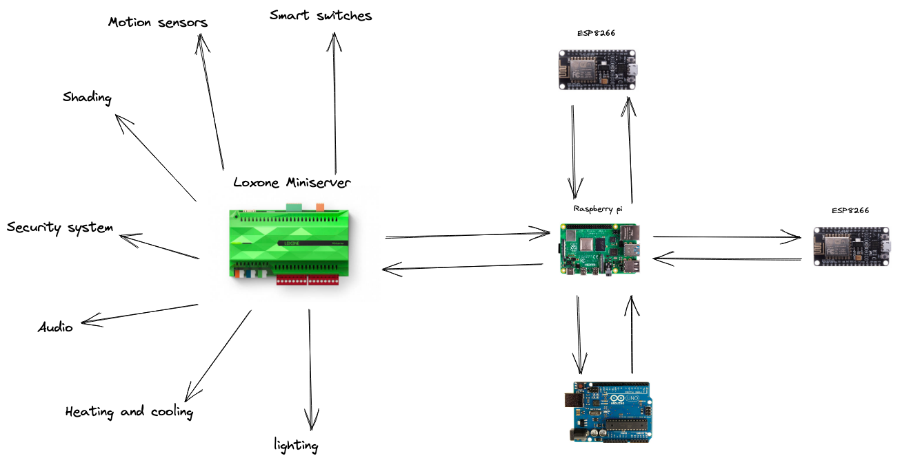
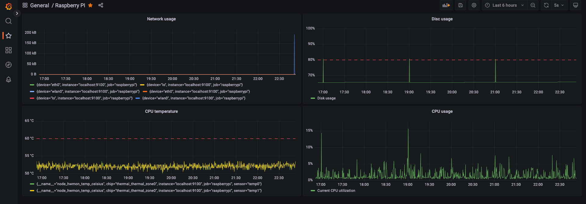

I'm building a house. I want to make it "smart". The goal is to save as much my (or my family's) time as possible in the future. I needed a plan about how to do it. After some research I came up with the following architecture.

Firstly, I needed a base. The base system that it will be the heart of everything. I had a few core requrements for it. 

* It should be easy to use for the end user. I don't expect that my wife or kid will learn some more in-depth details in order to setup basic things themselfs.
* No cloud required. I want to keep all my data locally. Noone should be ever able to reach them from outside if I won't allow them to do so.
* Have good support. I'm not an expert in the area so I'll need help. It's about my home. If I make a huge fuckup it will be hard to revert it.
* Be extentionable. I'm fine with choosing the manufacturer's featured divices but there should be a way to plug in third part devices as well.

After my reasearch, I decided to choose [Loxone](https://www.loxone.com/). I've been on their partner's training and I liked it a lot. I may write more about the company and it's devices. Please let me in the comments section below if you want to read more about it.

The Loxone miniserver will be responsible for contacting with any Loxone product including [smart switches](https://shop.loxone.com/enuk/touch-pure-tree-white.html) (there are more than just on-off switches), [presents sensors](https://shop.loxone.com/enuk/presence-sensor-tree-white.html), [audio](https://shop.loxone.com/enuk/audioserver.html), security and much more.

Loxone didn't develop everything I'd expect so I need a way to communicate with third-part devices or even those I'll build myself. Loxone has feature called Virtual Inputs and Virtual Outputs. Thanks to them, I can read or change a state using HTTP requests. So I needed a hub. I choose raspberry pi 4 for that. Any Arduino, ESP8266 devices will be contacting with Raspberry Pi and it will be communicating with Loxone miniserver.

This decision has some weaknesses. The biggest is a fact that if the Raspberry Pi will go down, I won't be able to communicate with other devices. That's why I setup some observability around Raspberry Pi and probably will buy more to get better availability if something will go wrong.

I setup a few Grafana dashboards with Prometheus metrics to make sure everything's OK. Here's one of them.

I'll cover topics like the devices I chose, technologies, and automation I have in mind, and a detailed description of how I build my custom devices as well. I'm extremely happy that I started the journey and cannot wait to show you what I've built!
