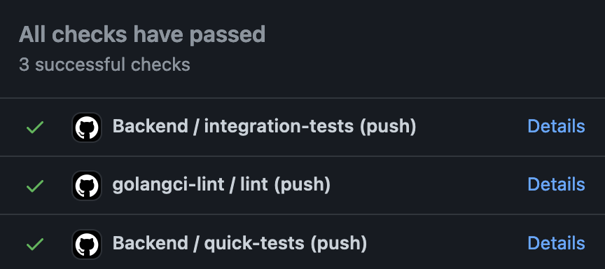

There are many practices and tactics that tackle testing. Today, I'll share with you how I write tests in my projects. Please notice that you may find it useful when you're starting a new project or an independent part of existing applications. You may find it difficult to apply in an already existing application. It's not impossible but may be challenging.



## General rules for tests

### (quick) tests should work out of the box

When someone clones our project, the person should be able to run basic tests without any setup. It's a good thing when you have an open-source project as well as when you have a new teammember. Or even for you after you reinstalled your PC. I remember many projects where I had to spend a day or to to make it working and actually start developing something. It's frustrating when you have to manually setup DB connection, get proper permissions to AWS account, configure it correctly and so on.

### Single responsible

One test function should test only one scenario. For different business cases we should have different test functions. There's a temptation to put more assertions or requrements in already existing test. The problem I can see here is the fact that those tests are getting more and more complicated. Very often, we put happy path with error cases into single test function and use table tests to run them as shown below.

```go
func TestFetchingProductsFromCatalog(t *testing.T) {
	is := is.New(t)
	ctx := context.Background()
	appServ := app.NewProductService(storage)

	productID, err := addNewProduct(ctx, storage)
	is.NoErr(err)

    tCases := map[string]struct {
        productID string
        expectedError error
    }{
        "product exists": {
            productID: productID,
            expectedError: nil,
        },
        "product does not exist": {
            productID: "invalid ID",
            expectedError: domain.ErrProductDoesNotExist,
        },
    }


    for name, tCase := range tCases {
        // when
        fetched, err := appServ.Find(ctx, productID)

        if tCase.expectedError == nil {
            // then
            is.NoErr(err)
            is.NoErr(productEquals(p, fetched))
        } else {
            is.True(errors.Is(tCase.expectedError, err))
        }
    }
}
```

And now let's compare it with an example where we split those cases into separate test functions.

```go
func TestFetchingProductInTheCatalog(t *testing.T) {
	is := is.New(t)
	// given
	ctx := context.Background()
	appServ := app.NewProductService(storage)

	productID, err := addNewProduct(ctx, storage)
	is.NoErr(err)

	// when
	fetched, err := appServ.Find(ctx, productID)

	// then
	is.NoErr(err)
	is.NoErr(productEquals(p, fetched))
}

func TestFetchingProductDosNotExistInTheCatalog(t *testing.T) {
	is := is.New(t)
	// given
	ctx := context.Background()
	appServ := app.NewProductService(storage)

	// when
	fetched, err := appServ.Find(ctx, "any product ID")

	// then
	is.True(errors.Is(err, domain.ErrProductDoesNotExist))
}
```

Of course, adding more test cases is simpler in the first example but only in the theory. In the long run, we'll want to add more edge cases that will require adding more fields to our anonymous struct. It will requre adding more logic to our tests what's a bad practice as well.

### Tests case should be as simple as posstible

When you look at the code inside you should be able to easily find out what's the goal of it. Even without reading the name of the test function. When we look at the previous example you should quite quickly understand what's happening in the test.

```go
func TestFetchingProductDosNotExistInTheCatalog(t *testing.T) {
	is := is.New(t)
	// given
	ctx := context.Background()
	appServ := app.NewProductService(storage)

	// when
	fetched, err := appServ.Find(ctx, "any product ID")

	// then
	is.True(errors.Is(err, domain.ErrProductDoesNotExist))
}
```

We prepare a service with a storage, fetch a product with non existing ID and check if we get an `ErrProductDoesNotExist` error. It's hard me to imagine to write it in a even simpler way.

### Irrelevant code should be extracted

Very often we need to build an object in a correct state or have some pre-requrements. We can put them in a helper method or a type and put the logic there. Let's say we're writing a test case for returning a book to a library.

```go
func TestBorrowingABook(t *testing.T) {
    is := is.New(t)

    lib := library.New(storage)
    book := library.NewBook("ISBN", "Title", "Author", 1930)
    lib.RegisterBook(book, 1)
    usr := library.NewUser("user ID", "Johny", "Bravo")

    err := lib.Borrow(usr.ID, book.ISBN)
    is.NoErr(err)
}
```

In this example, we have many unrelevant details like name of the user, some IDs and so on. In this context, they are not important. When we randomize those identifiers the code is even more complex.

```go
func TestBorrowingABook(t *testing.T) {
    is := is.New(t)

    lib := library.New(storage)
    bookISBN := randomISBN()
    book := library.NewBook(randomISBN, "Title", "Author", 1930)
    lib.RegisterBook(book, 1)
    usrID := randomID()
    usr := library.NewUser(usrID, "Johny", "Bravo")

    err := lib.Borrow(usr.ID, book.ISBN)
    is.NoErr(err)
}
```

When the project grows, we'll keep adding more and more details that hide the true purpose of this test. Let's refactor it to make it more readable.

```go
func TestBorrowingABook(t *testing.T) {
    is := is.New(t)

    // given
    bookID, userID, lib := bookInLibrary(storage)

    // when
    err := lib.Borrow(usr.ID, book.ISBN)

    // then
    is.NoErr(err)
}
```

Can you see the difference? We hidden all the setup and unnecessery details into the `bookInLibrary` function so our test is much clearer and smaller. The helper function can be reused in other tests.

## How does the architecture of the package look like?

Before I show you my approach, I have to explain how I design packages. You can read in more detail in another [blog post](https://developer20.com/how-to-structure-go-code/). Today, I'm focusing on the "Clean Architecture", one that I found the most useful in business-focused applications.

I split tests into three parts: [given, when and then](https://martinfowler.com/bliki/GivenWhenThen.html). In the `given` section I prepare everything. In the `when` section (often it's 1 line long) I operate I want to test. In the last `then` part, I make assertions. You can see an example below.


```go
var storage app.ProductStorage

func TestFetchingProductInTheCatalog(t *testing.T) {
	is := is.New(t)
	// given
	ctx := context.Background()
	appServ := app.NewProductService(storage)

	productID, err := addNewProduct(ctx, storage)
	is.NoErr(err)

	// when
	fetched, err := appServ.Find(ctx, productID)

	// then
	productID, err := addNewProduct(ctx, storage)
	is.NoErr(err)
	is.NoErr(productEquals(p, fetched))
}
```

Let's ignore the `storage` variable for a while. While designing both tests and the API I think about how many things I can hide to make the test more and more readable. That's why I created the `buildProduct()` methods that just build the product. Details about how exactly it looks like aren't important here so I extracted it to the function. We can go even further and extract adding the product to the storage.

```go
	productID, err := addNewProduct(ctx, storage)
	is.NoErr(err)
```

Here comes the interesting part - the `storage` variable. As you can see, its type is `app.ProductStorage`. It's an interface. I prepared two implementations of the interface. The first one is in-memory (used mostly in tests). Initializing the in-memory version is straightforward.

```go
//go:build !integration

package tests

import "github.com/bkielbasa/go-ecommerce/backend/productcatalog/adapter"

func init() {
	storage = adapter.NewInMemory()
}
```

Please notice the build tag I added at the top of the file. It says: "compile this file as long as the `integration` build tag isn't provided". All tests, by default, should be fast and reliable. We'll want to run them very frequently so we shouldn't wait for their results too long. What's more, it's a good practice when someone downloads our project and type `go test ./...` all tests are passing.

There's nothing more annoying than reading docs and setting up everything just to be able to run tests. Making this first experience a pleasure improves morale.

What if we want to test against a real database? I create a separate file (I put it next to the previous one) with connecting to everything I need.

```go
//go:build integration

package tests

import "fmt"
import "github.com/bkielbasa/go-ecommerce/backend/productcatalog/adapter"
import "os"

func init() {
	pass := getEnv("POSTGRES_PASSWORD", "")
	var conn string

	if pass != "" {
		conn = fmt.Sprintf("host=%s port=%s user=%s password=%s dbname=%s sslmode=disable", getEnv("POSTGRES_HOST", "localhost"), getEnv("POSTGRES_PORT", "5432"), getEnv("POSTGRES_USER", "bartlomiejklimczak"), pass, getEnv("POSTGRES_DB", "ecommerce"))
	} else {
		conn = fmt.Sprintf("host=%s port=%s user=%s dbname=%s sslmode=disable", getEnv("POSTGRES_HOST", "localhost"), getEnv("POSTGRES_PORT", "5432"), getEnv("POSTGRES_USER", "bartlomiejklimczak"), getEnv("POSTGRES_DB", "ecommerce"))
	}

	s, err := adapter.NewPostgres(conn)
	if err != nil {
		panic("cannot establish connection to postgres: " + err.Error())
	}

	storage = s
}
```

I get Postgres credentials from env variables and initialize the Postgres adapter. This test expects that all migrations were executed and the application has access to the database. On the top of the file, I added `go:build integration` build tag that says: "if the `integration` build tag is provided, compile this file".

Right now, when I type `go test ./...` when I want quick feedback. To run **the same** tests but with a real database or message broker I type `go test ./... -tags integration`. This approach has one big advantage.

When I want to change something in the logic of the application I can run quick tests only. I run integration tests only before pushing to a remote branch. Both tests should be run in CI/CD as well.




Please notice that this approach works mostly on business-focused applications. If you're writing a library or a tool, the logic inside of your code may not be that significant as it is in business applications.

To make the usage even more developer-friendly, I add a `Makefile` with task `make test` and `make integration-test` so I don't have to remember about proper tags.


## Summary
I showed you how it may work on package level but nothing stops you from writing similar tests but with end-to-end in mind. You can run the whole application and test your HTTP API with mocked or real databases under the hood. Thanks to this you'll write less number of tests that should cover most of the success paths.

The drawback is the need for implementing two implementations of the same thing. It may take some additional time. In my opinion, in long term, it pays off.

Please let me know what you think about it or share with you ways of writing tests in the comments section below.
