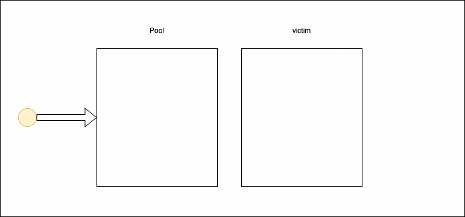

In the garbage-collected world, we want to keep the GC overhead as little as possible. One of the things we can do is limiting the number of allocations in our application. How to achieve that? There’s `sync.Pool` which caches allocated but unused items for later reuse.

The Pool can become very useful when you have multiple parallel operations that can share the same piece of memory between them. The real power of it is visible when you have frequent allocations and deallocations of the same data structure. The Pool scales up when the load increases and can be cleared in every 2 GC circles. I’ll explain the algorithm behind it a bit later. Right now, I focus on how to use it.


var pool = sync.Pool{
    New: func() interface{} {
        s := myStruct{}
        return &s
}}


After creating the Pool, you can start using it. It’s not required to define the `New` function in the Pool. However, if we skip it, we have to assume that the Pool can return a `nil` when it’s empty. It means we have to populate the Pool with some items to be able to receive them.


data := pool.Get().(*myStruct)
data.Reset()
defer func() {
    pool.Put(s)
}()
// do something with the data


Clearing the data is essential to prevent using dirty data which can lead to a hard to find issue. It’s always safer to be sure you reset the data just after fetching it from the Pool.

The Pool has its performance cost. Using the Pool is much slower than the initialization for simple data.


func BenchmarkPool(b *testing.B) {
        var p sync.Pool
        b.RunParallel(func(pb *testing.PB) {
                for pb.Next() {
                        p.Put(1)
                        p.Get()
                }
        })
}

func BenchmarkAllocation(b *testing.B) {
        b.RunParallel(func(pb *testing.PB) {
                for pb.Next() {
                        i := 0
                        i = i
                }
        })
}

// result
goos: darwin
goarch: amd64
BenchmarkPool-8                 294601358                3.92 ns/op
BenchmarkAllocation-8           1000000000               0.244 ns/op


Another thing you should have in mind that if the GC is called often enough or you use the pool rarely, you may not notice the benefits of using it.


func BenchmarkNoGC(b *testing.B) {
        b.ReportAllocs()
        var a, z [1000]*flate.Writer
        p := sync.Pool{New: func() interface{} { return &flate.Writer{} }}
        for i := 0; i < b.N; i++ {
                for j := 0; j < len(a); j++ {
                        a[j] = p.Get().(*flate.Writer)
                }
                for j := 0; j < len(a); j++ {
                        p.Put(a[j])
                }
                a = z
                // runtime.GC()
        }
}

func Benchmark(b *testing.B) {
        b.ReportAllocs()
        var a, z [1000]*flate.Writer
        p := sync.Pool{New: func() interface{} { return &flate.Writer{} }}
        for i := 0; i < b.N; i++ {
                for j := 0; j < len(a); j++ {
                        a[j] = p.Get().(*flate.Writer)
                }
                for j := 0; j < len(a); j++ {
                        p.Put(a[j])
                }
                a = z
                runtime.GC()
                runtime.GC()
        }
}

// result:
goos: darwin
goarch: amd64
Benchmark-8                    5         292123357 ns/op        663576916 B/op      1031 allocs/op
BenchmarkNoGC-8            26190             41001 ns/op           25337 B/op          0 allocs/op


The benchmark above shows the scenario where the GC is called very often. It is the reason why there are so many allocations. The Pool has to recreate objects on every iteration. As a comparison, the second benchmark test is almost the same. The only difference is removing the `runtime.GC()` call which forces the runtime to collect the garbage.

## How does the pool work?
You may be wondering why I put `runtime.GC()` twice in the test. The reason behind is that the Pool isn’t entirely cleared on every GC circle. The animation below visually explains how it works.

Every `sync.Pool` has two containers for elements: local Pool and victim cache. Every item is put in a local pool. When the GC is running, all elements from the local Pool are moved to the victim cache. If there’s anything in the victim cache before the garbage collection is executed it’s cleared. New items are put in the local Pool, but retrieved items are taken from the victim cache in the first place. If the VC is empty items are taken from the local Pool.

It means that those elements that weren’t retrieved from the victim cache will vanish in the next GC. It is the reason why you may not notice the benefits of using the Pool.

## When can the pool be useful?
When you have an object that is expensive in the creation, and you have to create it quite often, it can be very beneficial to use `sync.Pool` in your application. In the example below, you can find a benchmark of two approaches: with and without the `sync.Pool`.



func BenchmarkWriteGzipWithPool(b *testing.B) {
        writerGzipPool := sync.Pool{
                New: func() interface{} {
                        return gzip.NewWriter(ioutil.Discard)
                },
        }
        b.ResetTimer()
        b.ReportAllocs()
        for n := 0; n < b.N; n++ {
                data := bytes.NewReader([]byte("Lorem ipsum dolor sit amet, consectetur adipiscing elit. Pellentesque molestie."))
                writer := writerGzipPool.Get().(*gzip.Writer)
                writer.Flush()
                io.Copy(writer, data)
                writerGzipPool.Put(writer)
        }
}

func BenchmarkWriteGzipWithoutPool(b *testing.B) {
        b.ReportAllocs()
        for n := 0; n < b.N; n++ {
                data := bytes.NewReader([]byte("Lorem ipsum dolor sit amet, consectetur adipiscing elit. Pellentesque molestie."))
                writer := gzip.NewWriter(ioutil.Discard)
                io.Copy(writer, data)
        }
}

// result:
BenchmarkWriteGzipWithPool-8              352261              3127 ns/op             141 B/op          2 allocs/op
BenchmarkWriteGzipWithoutPool-8             9320            126938 ns/op          807088 B/op         16 allocs/op


In the version with the optimization, we have only two allocations per operation (compared to 16), and it runs about 40 times faster thanks to that. As you can see, the overhead of using the Pool is much smaller than the benefits we have in exchange.

## Summary

I think I won’t be original and say: don’t pre-optimize your code. Always build your opinion based on measurements. I was wrong about the bottleneck surprisingly often. So, remember to measure before and after any change to make sure it was an improvement.

In the article, you learned how to use the `sync.Pool` struct to optimize the number of allocations. You learned in which situations object pools can be useful and a few drawbacks.
The object pool pattern isn’t Go specific. You can found it in [c#](https://docs.microsoft.com/en-us/dotnet/standard/collections/thread-safe/how-to-create-an-object-pool) or [c++](https://dzone.com/articles/creating-object-pool-java). It only shows that this pattern is typical, and it’s valuable to keep it in mind.
