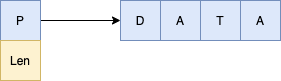
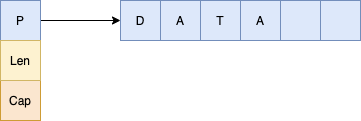
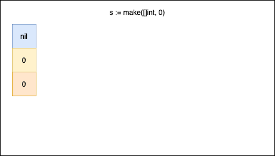
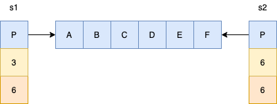
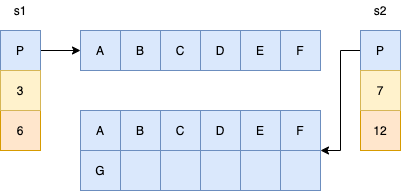
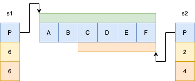

Slice is the most important data structure in Go. When it comes to performance, slices are going to beat any other data structure. They are simple but powerful. However, there are some gotchas you have to keep in mind. Today, I’ll explain how slices work to help you prevent some hard to find bugs and write better code.

In Go, arrays have a fixed size. The length is part of [the array's type](https://golang.org/ref/spec#Array_types). It means that two arrays of integers but with different sizes are different types.

You can think about slices as dynamic arrays. In the Go source code, the slice is represented as a struct with three elements in it.


type slice struct {
array unsafe.Pointer
len int
cap int
}


This means that typical slice manipulation may be cheap. If you’re taking some part of the slice or add a new element with available capacity - it’s nothing more than putting the data into its place in the memory and changing two integers.

In comparison to arrays, slices are dynamical arrays with (very often) preallocated memory. Slices do allocation under the hood for us. I'll explain in examples how it actually works.

You can see that at the very beginning, the slice has nil as his internal pointer to his underlying array. Both size and capacity are set to zero. When we add the first element to the slice, the `append()` method will use value semantics, create an underlying array, mutate the copy of the sliced array and return it. This approach allows operating on slices without side effects.

In the next iteration, the slice is copied once again. Because we initialise the array with a length of 1 and we have no free space in the array, a new array with a length of 2 is created. The pointer changes his direction to the freshly created array and the new slice is returned.

In the 3rd iteration, we repeat all steps. The only difference is that an array with a length of 4 is created. This gives as one space available for future appends.

The code below illustrates the behaviour. You can notice that until 1024 elements in the array, the capacity was doubled.


package main

import (
"fmt"
)

func main() {
s := make([]int, 0)

    for i := 1; i <= 10000; i++ {
    	if len(s) == cap(s) {
    		desc(s)
    	}
    	s = append(s, i)

    }

}

func desc(s []int) {
fmt.Printf("len(%d), cap(%d)\n", len(s), cap(s))
}


However, after reaching the limit the algorithm changes. It starts adding 25% of the previous capacity instead of doubling it. We can see how it's implemented in the code below (actual Go code).


if old.len < 1024 {
newcap = doublecap
} else {
// Check 0 < newcap to detect overflow
// and prevent an infinite loop.
for 0 < newcap && newcap < cap {
newcap += newcap / 4
}
// Set newcap to the requested cap when
// the newcap calculation overflowed.
if newcap <= 0 {
newcap = cap
}
}


Notice that every time the reallocation happens (if there's no other reference to the slice) we produce garbage in the memory. The GC has to collect it on every GC circle. This can make everything slower. Reallocation also takes time.

You have to be careful with `append()`ing and reusing already allocated data. Let's take a slice with 3 elements but with the capacity of 6. Then, create a new slice based on the first and add the missing 3 elements to it.


s1 := make([]byte, 0, 6)
s1 = append(s1, 'A', 'B', 'C')
desc(s1)

s2 := s1
s2 = append(s1, 'D', 'E', 'F')
desc(s2)

/_ Output:
len(3), cap(6): ABC
len(6), cap(6): ABCDEF
_/


Everything looks OK till now. Both variables share the same piece of memory. It can be dangerous if you're not careful. In our example, the first slice has a length equal to 3. When you add a new element to it, both slices will be affected.

The fourth element in the array is updated. It means that D is replaced with G in both slices.


s1 = append(s1, 'G')
desc(s1)
desc(s2)

/\* Outputs
len(4), cap(6): ABCG
len(6), cap(6): ABCGEF

Test it in the playground: https://goplay.space/#G0QsYaNOWG9
\*/


Due to the nature of a slice, which we have already described, the behaviour will change when we add a new element to the second slice just before adding the 4th element to the first array.


s2 = append(s2, 'H')
s1 = append(s1, 'G')

desc(s1)
desc(s2)

/\* Outputs
len(4), cap(6): ABCG
len(7), cap(16): ABCDEFH

Test it in the playground: https://goplay.space/#BmP4WEFnteG
\*/


As you remember, when you add a new element to a slice with full capacity, it relocates the array with bigger capacity, copies data to the newly allocated memory and adds the element there. It means that changing the first slice won't affect the second slice any more.

You can prevent such inconsequences and hard to find bugs by copying the data to the new slice.


s1 := make([]byte, 0, 6)
s1 = append(s1, 'A', 'B', 'C')
desc(s1)

s2 := make([]byte, 3, 6)
copy(s2, s1)
desc(s2)

s2 = append(s2, 'H')
s1 = append(s1, 'G')

desc(s1)
desc(s2)

/\* Outputs:
len(3), cap(6): ABC
len(3), cap(6): ABC
len(4), cap(6): ABCG
len(4), cap(6): ABCH

Test it in the playground: https://goplay.space/#UPW7Cnmm-rf
\*/


Taking a slice of a slice is quite trivial in Go. Because we're working with the same piece of memory the operation is fast. You can get sub-slice using syntax `[a:b:c]`. All digits are indexes in the slice. The first number points from which index is the starting point for the next slice and the second is the index of the end of the slice. This can be counter-intuitive to some people. As some people may think that the second value is the length of the new slice. That's not true and you'll see it in the example.


s1 := []byte("ABCDEF")
s2 := s1[2:4]
desc(s1)
desc(s2)

/\* Outputs
len(6), cap(6): ABCDEF
0x40e020: A
0x40e021: B
0x40e022: C
0x40e023: D
0x40e024: E
0x40e025: F
len(2), cap(4): CD
0x40e022: C
0x40e023: D

Test it in the playground: https://goplay.space/#aC9L2zfJ1hb
\*/


The new slice has a length equal to 2. The syntax can be translated to: start a new slice from index `a` to `b` but not including `b`. In mathematical form, it would look like this `[a, b)` where `a <= b`. In other words, the length of the slice will be `b - a`.
The backend array is shared between those two slices. It means that this array is susceptible to the same problem as with adding to the slice.
The capacity of the new slice will be the equal total number of elements since index `a` to the end of the slice. However, you can control the capacity using three index slices.


s1 := []byte("ABCDEF")
s2 := s1[2:4:4]
desc(s1)
desc(s2)

/\* Outputs
len(6), cap(6): ABCDEF
0x40e020: A
0x40e021: B
0x40e022: C
0x40e023: D
0x40e024: E
0x40e025: F
len(2), cap(2): CD
0x40e022: C
0x40e023: D

Test it in the playground: https://goplay.space/#U2BwcDH3m35
\*/


Unfortunately, this doesn't prevent side-effects. Elements in slides can still be modified by changing a different slice. They still have the same address in memory. To be sure you're free from such bugs, use `copy()`.


s1 := []byte("ABCDEF")
s2 := make([]byte, 2)
copy(s2, s1)
desc(s1)
desc(s2)

/\* Outputs

len(6), cap(6): ABCDEF
0x40e020: A
0x40e021: B
0x40e022: C
0x40e023: D
0x40e024: E
0x40e025: F
len(2), cap(2): AB
0x40e026: A
0x40e027: B
\*/


As you can see, both `A` elements now have different addresses in the memory.

### Iterating over a slice

Go has two kinds of semantics: pointer and value semantic. In the first kind, we reuse the same piece of memory, in value semantic, we create a copy of it. You use it in declaring a function.


func myFunc(v int) // value semantic
func myFunc(v \*user) //pointer semantic


You can use both semantics while iterating over the slice. It's crucial to remember about when you use the pointer and when value semantics. Let's analyse the code below.


func main() {
products := []product{
product{100}, product{200},
}
desc(products)

    for _, p := range products {
        p.price = p.price + 200
    }

    desc(products)

    for i := range products {
        products[i].price = products[i].price + 200
    }

    desc(products)

}

/\* Outputs

---

price: 100
price: 200

---

price: 100
price: 200

---

price: 300
price: 400
\*/


There are a few more things to keep in mind about loops. Firstly, when using value semantic, the runtime creates a copy of the slice and uses it. It means that when we shrink the slice to only 1 element, it will iterate 4 times. 4 times because of the copy of the slice it’s using. After the loop, the copy of the slice is dropped and you have only 1 element slice to use. The example below illustrates the behaviour.


func main() {
prices := []int{100, 200, 300, 400}

    for _, v := range prices {
        prices = prices[:1]
        fmt.Println(v)
    }

    desc(prices)

}

/_ Outputs
100
200
300
400
len(1), cap(4)
100
_/


On the other hand, the pointer semantic doesn’t create a copy of the slice but just remembers the number of elements in it. Inside of the loop, it’s operating on the same slice as below and after it.


func main() {
prices := []int{100, 200, 300, 400}

    for i := range prices {
        prices = prices[:1]
        fmt.Println(prices[i])
    }

    desc(prices)

}


What will be the output of the code? At the first iteration, you’ll get 100 but at the second… panic. As I said before, by modifying the slice we say that the slice has length 1 but the runtime “remembers” that it has 4 elements and tries iterating. The iterator now contains 1 (second element) but the slice thinks it has only one so it panics.

As you can see, there are some details it's worth remembering. It can help you prevent some hard to find bugs. Depending on when `append()` allocates a new underlying array the behaviour can change. The code below illustrates one of the problematic scenarios.



func main() {
coreInts := make([]int, 0, 5)
coreInts = append(coreInts, 1, 2, 3, 4, 5)

    desc(coreInts) // prints: 1,2,3,4,5
    ints := coreInts[1:3]
    desc(ints)     // prints: 2,3
    desc(coreInts) // prints: 1,12,13,4,5

    addTen(ints)
    desc(ints) // prints: 12, 13

    coreInts = append(coreInts, 6)
    addTen(ints)
    desc(ints)     // prints: 22, 23
    desc(coreInts) // prints: 1,12,13,4,5

}



In the end, we could expect to get 1, 22, 23, 4, 5 as the result of updating the ints slice. The first `addTen` method updates the `coreInts` array but the second call of the function doesn't do it because `append()` reallocated the memory in the meantime.
